# C++结合Qt编译环境学习

## C++和C的区别

C++又叫C plus plus

### 编程语言的分类

面向过程语言：C       ----->重视求解过程
面向对象语言：C++   ------>重视求解的方法

### C和C++语法上的区别

    1.命名空间(用于解决命名冲突问题)
    2.函数重载和运算符重载(一名多用)
    3.引用(和指针类似)
    4.面向对象的特征(封装、继承和多态)
    5.泛式编程
    6.模板编程
    7.STL标准模板库

## qt软件的使用

### qt快捷方式

可以直接从菜单栏发送到桌面
找到安装路径，把qt的.exe发送到桌面
D:\Qt\Qt5.12.4\Tools\QtCreator\bin

### 修改编码格式
目的：可以不乱码输出中文
工具----->选项

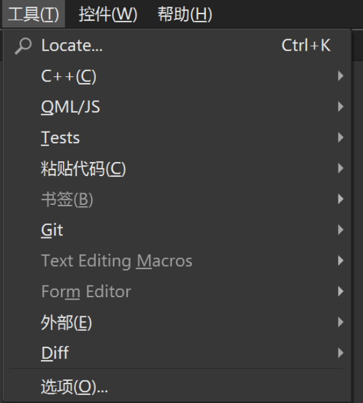

文本编辑器----->行为------>修改编码格式

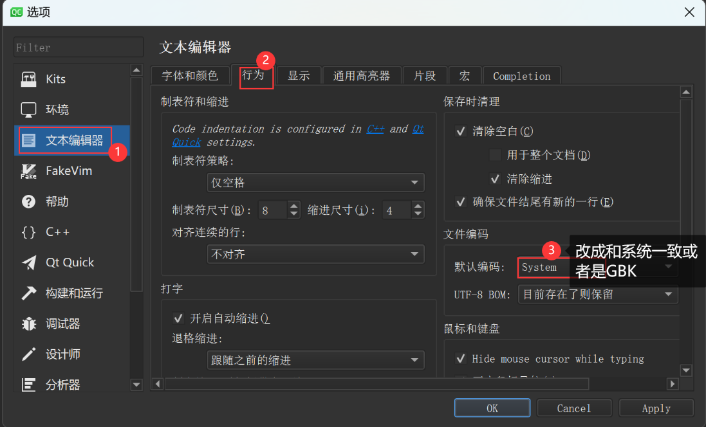
### 创建文件

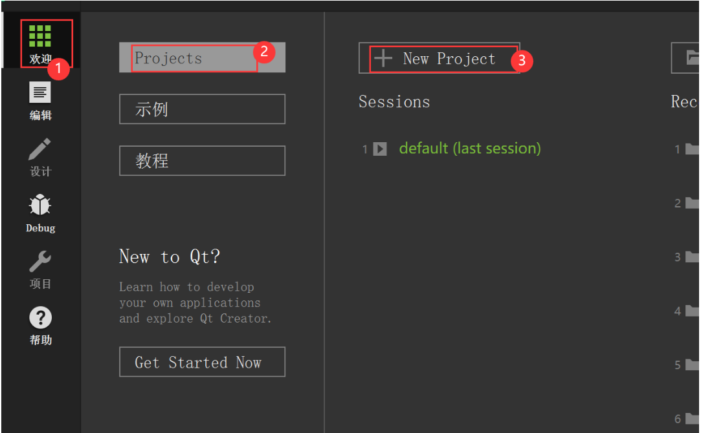
创建C++项目
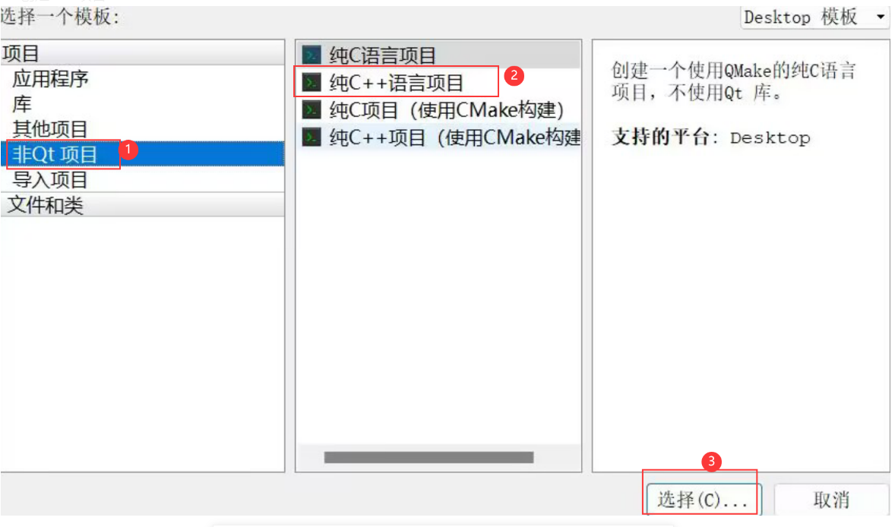

创建文件
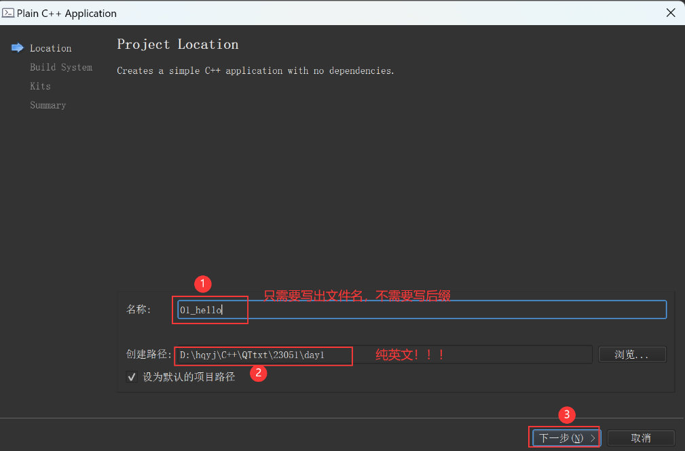

## C++程序
### 命名
C语言文件以.c结尾，gcc 编译C语言程序
C++以.cpp 或者 .C结尾，g++编译C++程序
### C++对C的兼容
C++支持几乎所有的C语言语法
C++中想要使用C中的头文件，一般去掉.h，在头文件前加上c
g++可以编译C程序，但是gcc不能编译C++程序
### 编写C++程序

```c++
#include <iostream>    
//导入头文件,导入istream和ostream

using namespace std;   //使用标准明明空间std

int main()      
{
    cout << "hello world!" << endl;
    //cout是一个标准输出流对象
    //endl换行
    // <<插入运算符的重载/输出运算符的重载

    return 0;
}
```

### 标准输出流对象 ---->cout
printf()在输出时，需要使用格式符：%d,%f,%c,%#X,%s······
cout在输出时，不需要任何格式符，cout会自动推到输出的类型
    面向对象的三大特征：封装、继承和的多态，(依赖于类)
    cout时ostream类的一个对象   ----->实现输出的作用
cout格式化输出，如果使用函数，需要导头文件<iomanip>
```C++
#include <iostream>
#include <iomanip>    //使用函数改变cout的输出格式
using namespace std;

int main()
{
    int a = 100;
    int b = 16;
    cout << "a=" << a << endl;    //级联使用cout
    //printf可以通过格式符实现十进制，十六进制以及八进制的输出
    //如果cout想完成同样的事情，可以通过关键字或者是函数

    cout << "------------------------" << endl;
    //关键字实现cout的输出
    cout << "输出a的十六进制" << endl;
    cout << hex << a << endl;    //64
    cout << b << endl;     //10   因为上一句已经修改过cout的输出格式
    cout << dec  << "十进制" << b << endl;
    cout << "b的八进制" << oct << b << endl;

    //通过函数实现格式化的输出
    cout << "------------------------" << endl;
    cout << "a的十六进制" << endl;
    cout << setbase(16) << a << endl;
    cout << setbase(10) << a << endl;

    //cout实现对齐输出
    cout << setw(6) << left << a << b << endl;
    //setw默认右对齐,想要回复右对齐，只需要把left改成right

    cout << 8.12266577 << endl;   //cout在输出浮点型数据时，会把小数点算进输出位数里面

    //加上fixed关键字，输出浮点数位置，默认不算小数点
    cout << setprecision(8) << fixed << 8.12266577 << endl;
    //没有办法取消输出格式，但是可以回到默认格式
    cout << setprecision(5) << 8.12266577 << endl;
    
    return 0;
}
```

### 标准输入流对象  ---->cin
istream类的一个类对象
cin根据变量类型来自动推导
```c++
#include <iostream>

using namespace std;

int main()
{
    int a;
    float b;
    cin >> a >> b;   //cin也可以级联使用，不能加endl

    //cin会自动控制格式，要求：用户输入和源代码中的输入格式必须严格对应
    //比如给整形数据，输入3.14，0.14还在缓冲区，就会被获取给下一个浮点型变量
    cout << b;

    cout << a;

    return 0;
}
```

练习：
1、终端输入一个字符，判断是数字字符，字母还是标点符号
```c++
#include <iostream>

using namespace std;

int main()
{
    char c;
    cin >> c;
    if(c>='0'&&c<='9')
    {
        cout << "c是一个数字" << endl;
    }
    else if (c>='a'&&c<='z')
    {
        cout << "c是一个小写字符" << endl;
    }
    else if (c>='A'&&c<='Z')
    {
        cout << "c是一个大写字符" << endl;
    }
    else
    {
        cout << "C是一个标点" << endl;
    }
    return 0;
}
```

2、输出斐波那契数列   1    1     2     3     5     8······
```c++
#include <iostream>
using namespace std;

int main()
{
    int arr[20]={1,1};

    //给斐波那契的每一项赋值
    int i;
    //i=2防止越界
    for (i=2;i<20;i++)
    {
        arr[i] = arr[i-1]+arr[i-2];
    }

    for (i=0;i<20;i++)
    {
        cout << arr[i] << endl;
    }
    return 0;
}
```

## 命名空间
用于解决命名冲突/明明污染问题
### 接触到的第一个命名空间
标准命名空间std：cout    endl    cin
如果代码中没有using namespace std，cout和endl会报错
### 定义
命名空间中可以存放，标识符：变量名、函数名、结构体名、枚举名

    namespace 命名空间名
    {
        定义变量;
        函数声明;
        结构体名;
        ···
    };
    命名空间中，只能存放函数的声明，不能放函数的定义

### 使用命名空间中的标识符
域限定符    ::
#### 全局导入整体命名空间
using namespce 命名空间名;
在该行下的所有代码，都可以使用A中的所有标识符
#### 全局导入部分标识符
using 命名空间名::标识符名;
在该行下的所有代码，可以使用导入的指定的标识符
#### 局部导入标识符
在哪个位置使用，使用时直接通过域标识符来进行限定
```C++
#include <iostream>
using namespace std;
namespace A
{
    int a=90;
    char c='x';
    float p=3.14;
    void fun();
};
int main()
{
    A::fun();
    cout << A::a << endl;
    return 0;
}
```
```C++

#include <iostream>
using namespace std;
namespace A
{
    int a=90;
    char c='x';
    float p=3.14;
    void fun();
};


//命名空间内声明fun函数，在命名空间外定义fun函数，需要给函数名加域限定符::
void A::fun()
{
    cout << "fun函数" << endl;
}
//全局导入命名空间中的所有标识符
//using namespace A;


//全局导入命名空间中的部分标识符
/*using A::fun;
using A::a;
*/


int main()
{
    A::fun();
    cout << A::a << endl;
    return 0;
}
```


### 命名冲突问题

    main.cpp:27:5: error: call to 'fun' is ambiguous
    main.cpp:8:10: note: candidate function
    main.cpp:12:6: note: candidate function

#### 两个命名空间中标识符冲突
两个命名空间中有同名成员
同时可以访问两个命名空间中的成员
怎么解决：
命名空间名+域限定符
只导入一个命名空间，代码就只能访问导入的命名空间中的标识符
#### 局部变量和命名空间中标识符冲突
代码不会报错，但是只能默认访问局部变量
想要访问命名空间中的标识符：命名空间名+域限定符
```C++
namespace A
{
    int a=90;
    char c='x';
    float p=3.14;
    void fun();
};
int main()
{
    //在使用的位置使用域限定符
    A::fun();
    int a=100;
    cout << A::a << endl;
    cout << "B中的a=" << B::a << endl;
    return 0;
}
```

#### 全局变量和命名空间标识符冲突
访问全局变量：只在标识符前加域限定符
访问命名空间中标识符：命名空间名+域限定符
```c++
#include <iostream>
using namespace std;

int a=1000;   //定义了一个全局变量a
namespace A
{
    int a=90;
    char c='x';
    float p=3.14;
    void fun();
};
int main()
{
    //在使用的位置使用域限定符
    A::fun();
    cout << ::a << endl;    //加上域限定符访问全局变量的a，
    //因为全局变量,默认在匿名空间中
    cout << "B中的a=" << B::a << endl;
    return 0;
}
```

### 匿名空间
没有名字的命名空间，就是匿名空间
匿名空间中的标识符的访问方式：
::标识符名
注意：匿名空间中的标识符尽量不要和全局变量冲突
```c++

#include <iostream>
using namespace std;

int a=1000;   //定义了一个全局变量a

namespace B
{
     int a=130;
}
//命名空间内声明fun函数，在命名空间外定义fun函数，需要给函数名加域限定符::
void A::fun()
{
    cout << "fun函数" << endl;
}
//全局导入命名空间中的所有标识符
using namespace A;
//using namespace B;


//匿名空间,尽量不要使用匿名空间
namespace  {
     int a = 2000;
     char c;
}
int main()
{
    //在使用的位置使用域限定符
    A::fun();
    cout << ::a << endl;    //加上域限定符访问全局变量的a，
    //因为全局变量,默认在匿名空间中
    cout << "B中的a=" << B::a << endl;
    return 0;
}
```


### 嵌套的命名空间
一个命名空间定义在另一个命名空间内
访问时需要逐层查找
```c++
#include <iostream>

using namespace std;
namespace A1 {
     int num1 = 10;
     int num2 = 30;
     namespace A2
     {
         int num1=1;
         int num2=90;
         int x = 7;
     }
}

using namespace A1;
using namespace A1::A2;
int main()
{
    //想要访问A2中的num1
    //由于A2是包含在A1内的，想要访问到A2需要一层一层访问
    cout << A1::A2::num1 << endl;
    //cout << num2 << endl;   一定构成命名冲突问题
    cout << A1::num2 << endl;
    return 0;
}
```

### 给命名空间重命名
namespace  新的名字 = 旧的名字;
```c++
#include <iostream>


using namespace std;
namespace A1 {
     int num1 = 10;
     int num2 = 30;
     namespace A2
     {
         int num1=1;
         int num2=90;
         int x = 7;
     }
}


namespace p = A1;    //把命名空间A1重命名为p，后面既可以使用A1访问也可以使用p访问
using namespace A1;
using namespace A1::A2;
int main()
{
    //想要访问A2中的num1
    //由于A2是包含在A1内的，想要访问到A2需要一层一层访问
    cout << p::A2::num1 << endl;
    //cout << num2 << endl;   一定构成命名冲突问题
    cout << A1::num2 << endl;
    return 0;
}
```

### using的另一种用法
using还可以用于类型重定义
C++ 11标准才能使用using实现重定义

    typedef int arr[5];<===>arr相当于int [5]
    typedef int *p;   <===>p后面就相当于int *
```c++
#include <iostream>
using namespace std;

namespace p = A1;    //把命名空间A1重命名为p，后面既可以使用A1访问也可以使用p访问
using namespace A1;
using namespace A1::A2;
int main()
{
    //使用suing把int，重命名为INT，后面使用哪一个都可以定义整形变量
    using INT = int;
    INT a = 90;
    cout << a << endl;
    cout << sizeof(a) << endl;
    return 0;
}
```

## C++中的字符串
C中没有字符串类型
C++中提供了string类
### C++风格的字符串
C++中字符串并不严格的需要'\0'
#### 定义
```c++
string  变量名;

//单个变量的赋值
#include <iostream>
using namespace std;
int main()
{
    string str = "hi";    //定义了一个str字符串,使用hi初始化
    string str1("hello");    //定义了一个str1字符串,使用hello初始化
    string str2(5,'a');   //定义了一个str2字符串使用5个a初始化
    string str3(str1);    //定义了一个str3字符串使用str1进行初始化操作

    cout << "str=" << str << endl;
    cout << "str1=" << str1 << endl;
    cout << "str2=" << str2 << endl;
    cout << "str3=" << str3 << endl;
    return 0;
}
```

#### 多个字符串的赋值和比较
C++中的string类型，可以直接进行比较
```c++

#include <iostream>
using namespace std;
int main()
{
    string str = "hi";    //定义了一个str字符串,使用hi初始化
    string str1("hello");    //定义了一个str1字符串,使用hello初始化
    string str2(5,'a');   //定义了一个str2字符串使用5个a初始化
    string str3(str1);    //定义了一个str3字符串使用str1进行初始化操作

    str = str1+str2;     //使用已有的两个字符串拼接给新的字符串赋值

    //多个字符串string类型之间可以进行直接比较
    //可以直接使用 ==  !=  >=  <=  >  <
    if(str>str1)
    {
        cout << "str>str1" << endl;
    }
    cout << "str=" << str << endl;
    cout << "str1=" << str1 << endl;
    cout << "str2=" << str2 << endl;
    cout << "str3=" << str3 << endl;
    return 0;
}
```

### C++风格和C风格字符串的转换
C风格字符串向C++转化，无需任何操作
C++风格字符串向C语言转化，需要借助于成员函数data()和c_str()

```c++
#include <iostream>
#include <cstring>    //导入C中string.h头文件
#include <cstdio>
using namespace std;

int main()
{
    char str1[] = "hello";
    char str2[100] = "cat";
    strcat(str2,str1);    //实现把str1拼接到str2后面

    string s1 = str2;
    cout << "s1=" << s1 << endl;
    cout << "str2=" << str2 << endl;
    char str3[200];
    strcpy(str3,str2);
    //strcpy(str3,s1);   error C++风格的字符串不能直接转换为C语言风格

    //data和c_str叫做s1的成员函数
    strcpy(str3,s1.data());  //使用了data函数，实现了C++风格的字符串向C语言风格字符串的转换
    printf("%s\n",s1.c_str());   //使用了c_str成员函数，实现了C++风格的字符串想C语言风格字符串的转换
    return 0;
}
```

### 常用的函数
#### at()
使用方式：变量名.at(下标) 
作用：访问指定下标的元素
**注意：at函数会自动检查越界问题，如果访问越界，退出程序不再向后执行**
#### empty()
返回值是一个bool类型，判断字符串是否为空

    string s1 = "hi";
    s1.empty();  ---->0，因为s1非空
#### size/length
返回字符串的真实长度

    string s1 = "hi";
    s1.size();
    s1.length();
#### clear()
清空字符串

    string s1 = "hi";
    s1.clear();   ---->执行该语句后，再输出s1，值为空

```c++
#include <iostream>
#include <cstring>    //导入C中string.h头文件
#include <cstdio>
using namespace std;

int main()
{
    char str1[] = "hello";
    char str2[100] = "cat";
    //strcat(str2,str1);    //实现把str1拼接到str2后面

    cout << "s1=" << s1 << endl;
    cout << "str2=" << str2 << endl;
    char str3[200];
    strcpy(str3,str2);
    //strcpy(str3,s1);   error C++风格的字符串不能直接转换为C语言风格


    //data和c_str叫做s1的成员函数
    strcpy(str3,s1.data());  //使用了data函数，实现了C++风格的字符串向C语言风格字符串的转换
    printf("%s\n",s1.c_str());   //使用了c_str成员函数，实现了C++风格的字符串想C语言风格字符串的转换

    string s1 = str2;
    //cout << s1[6] << endl;    //字符串中的字符，仍然可以通过下标访问，下标访问不能检查越界问题
    cout << s1.at(1) << endl;   //访问string类型的变量时，通常使用at，at函数可以进行越界检查

    getline(cin,s1);   //getline需要两个参数，第一个参数cin输入流，字符串变量名
    cout << s1 << endl;
    cout << "s1是否为空" << s1.empty() << endl;
    cout << "s1的长度" << s1.size() << endl;
    cout << s1.length() << endl;
    cout << "s1" << s1 << endl;
    s1.clear();
    cout << "清空后" << "s1" << s1 << endl;
    return 0;
}
```

### 字符串的输入
    1.cin，不能获取带空格的字符串
    2.getline()，可以获取带空格的字符串
    getline格式:  getline(cin,变量名);


```c++
#include <iostream>
using namespace std;
int main()
{
    string s1 = str2;
    //cout << s1[6] << endl;    //字符串中的字符，仍然可以通过下标访问，下标访问不能检查越界问题
    cout << s1.at(1) << endl;   //访问string类型的变量时，通常使用at，at函数可以进行越界检查

    getline(cin,s1);   //getline需要两个参数，第一个参数cin输入流，字符串变量名
    cout << s1 << endl;
}
```

练习：
1、终端输入带空格字符串，计算大写字母和小写字母的个数

## C++中的bool类型
C中不直接支持bool类型，但是C++中支持bool类型

    1.bool在C++中可以直接使用，默认值为0，默认输出形式为数字
    2.bool类型变量在赋值时，可以使用数字，也可以使用true和false
    3.bool类型想以字母输出，需要加上boolalpha，如果想取消，加上noboolalpha
    4.bool类型的大小是1Byte
```c++
#include <iostream>
using namespace std;

int main()
{
    bool c;
    cout << c << endl;    //C++中bool类型的默认值为0
    c = true;    //使用单词给bool类型的变量赋值

    //bool类型默认输出为数字的形式
    cout << "赋值后" << c << endl;
    c = -10;
    cout << "赋值后" << c << endl;

    //转换为字母形式的输出
    cout << boolalpha << endl;
    c = 0;
    cout << "加上boolalpha后" << c << endl;
    c = 1;
    cout << c << endl;

    //取消字母表示
    cout << noboolalpha << endl;
    cout << c << endl;
    cout << sizeof(bool) << endl;  //1
    return 0;
}
```

## 引用
### 定义
引用和目标公用一片空间
对一片取别名
数据类型 &引用名 = 目标名;

### &的使用
1.取变量的地址
2.位运算符
3.&&逻辑与
4.引用，---->如果&前面有数据类型，就说明是在定义引用
### 引用的性质
1.引用必须初始化
2.访问引用相当于访问目标
3.引用的目标一旦指定，不能修改
4.引用和目标占用同一片空间(引用不会额外开辟空间)
```c++
#include <iostream>
using namespace std;

int main()
{
    int num1=30,num2=90;
    //int &ref2;   引用必须初始化
    int &ref1 = num1;   //定义了一个引用refn1，目标是num1
    //在后面，访问ref1和访问num1是同一个效果
    
    //尝试修改ref1的目标
    ref1 = num2;   //<===>num1 = num2;
    cout << ref1 << endl;
    cout << &num1 << endl;
    cout << &ref1 << endl;
}
```

### 引用作为函数的形参
好处：
1.不需要额外开辟空间
2.不涉及到值传递和地址传递的问题，传到函数内部的就是实参本身
```c++

#include <iostream>
using namespace std;


//可以实现两数交换，但是需要额外开辟两个指针的空间
void my_swap(int &x,int &y)   //my_swap(num1,num2);  int &x = num1;
{
    //由于形参是引用变量，所以函数内对形参的修改也是对实参的修改
      int temp;
      temp = x;
      x = y;
      y = temp;
}
int main()
{
    int num1=30,num2=90;
    //int &ref2;   引用必须初始化
    int &ref1 = num1;   //定义了一个引用refn1，目标是num1
    //在后面，访问ref1和访问num1是同一个效果

    //尝试修改ref1的目标
    ref1 = num2;   //<===>num1 = num2;
    cout << ref1 << endl;
    cout << &num1 << endl;
    cout << &ref1 << endl;

    my_swap(num1,num2);
    cout << "函数调用后" << endl;
    cout << "num1 = " << num1 << endl;
    cout << "num2 = " << num2 << endl;
    return 0;
}
```
### 数组引用和指针的引用

```c++
#include <iostream>

using namespace std;


int main()
{
    int arr[5]={89,12,34,0,5};
    int *p = arr;
    int *(&r3) = p;   //定义了一个指针p的引用r3
    //定义一个指向整个一维数组的指针
    //int (*p)[5];

    //定义一个数组arr的引用
    int a = 90;
    int &r1 = a;

    //定义了一个r2是arr数组的引用
    int (&r2)[5]  = arr;    //arr的数据类型int [5]
    return 0;
}
```

练习：
利用引用实现数组的传参，实现冒泡排序

```c++
#include <iostream>

using namespace std;
void my_sort(int (&arr)[10])
{

    int sz = (sizeof(arr)) / sizeof(arr[0]);
    for (int i = 0; i < sz; i++)
        cout << arr[i] << " ";
    for(int i=0;i<sz-1;i++)
        for (int j = 0; j < sz - 1 - i; j++)
            if (arr[j] > arr[j + 1])
            {
                int temp = arr[j];
                arr[j] = arr[j + 1];
                arr[j + 1] = temp;
        }
    cout << endl;
    for (int i = 0; i < sz; i++)
        cout << arr[i] << " ";
    cout << endl;

}
int main()
{
    int test[10]={34,2,1,65,99,33,66,19,3,22};
    my_sort(test);
    return 0;
}
```
### 引用作为函数的返回值

复习：指针作为函数的返回值   ---->指针函数

    1.全局变量
    2.static修饰的局部变量
    3.堆区申请的空间
    4.常量区的空间
    5.实参传递过去的地址          ------>返回的是生命周期长的变量的地址

引用作为函数的返回值，和指针函数一样，需要返回生命周期长的变量的引用

引用作为函数的返回值，是一个左值，(因为返回引用就是返回变量本身)，可以被赋值和自增自减运算

```c++
#include <iostream>
#include <cstdlib>
using namespace std;

int num1 = 12;
int &fun(int *p1)   //fun(&a);  <==>int *p = &a; p指向a
{
    //return num1;   // <==>返回num1的引用
    cout << p1 << endl;
    return *p1;   //p1是一个4Byte的指针，需要返回4Byte的int
}

int &fun1()
{
    return num1;
}
int main()
{
    int a = 90;
    int *p1 = (int *)malloc(4);
    cout << num1 << endl;   //12
    fun1()++ ;  // <==>num1++;

    cout << num1 << endl;
    *p1 = 90;

    return 0;
}

```

### 引用和指针的区别*

    1.引用定义必须初始化，指针定义可以不初始化(野指针)
    2.指针可以指向NULL，引用不可以
    3.可以改变指针的指向，不能改变引用的目标
    4.有指针数组但是没有引用数组
    5.指针会额外开辟空间，引用不会额外开辟空间
    6.有多级指针，没有多级引用

## 动态内存分配

C中的动态内存分配：malloc和free   ----->C++中可以继续使用
C++中动态内存分配的关键字：new、delete

### new

#### 单个内存空间的申请

```c++
回忆malloc:
int *p = (int *)malloc(4);


只申请单个空间的操作
数据类型 *指针名 = new 数据类型;   //new会按照数据类型申请空间
申请并初始化操作
数据类型 *指针名 = new 数据类型(初始值);   //申请到空间中的初始值就是()内的内容
```
#### 多个空间的申请

    数据类型 *指针名 = new 数据类型[size]{初始值};   
//使用new申请多个空间，仍然可以使用不完全初始化的方式，未初始化的部分默认为0

### delete

```c++
单个空间的释放：
delete 指针名;

多个空间的释放：
delete []指针名;


#include <iostream>

using namespace std;

int main()
{
    int *p = new int(3);    //指针p指向堆区申请的一个int的空间
    cout << *p << endl;
    string *ps = new string;

    int *ptr = new int[5]{2,3,5,6};   //申请了5个int的空间
    int i;
    for (i=0;i<5;i++)
    {
        cout << *(ptr+i) << endl;
    }

    delete p;     //释放单个的堆空间
    p = NULL;  //NULL的ASCII是0，可能会满足整形0的情况，
    //C++中提供的nullptr，只表示指针为空的情况
    delete [] ptr;   //释放多个堆空间，需要使用[]，[]内不需要写任何内容
    ptr = nullptr;


    return 0;
}
```

C++中不推荐使用malloc和free的原因：
malloc和free时不会自动调用构造函数和析构函数
new和delete会自动调用构造函数和析构函数

### new/delete和malloc/free的区别*

1.malloc申请时，需要强转，还需要计算申请空间的大小，使用new，不需要强转，也不需要求大小，malloc以字节申请，new以数据类型申请
2.malloc申请时不能执行初始化操作，new可以申请同时初始化
3.delete在释放空间时，需要考虑是单个空间还是多个空间，free不需要考虑空间问题
4.malloc和free是库函数，new和delete是关键字
5.malloc不会调用构造函数，new会
6.free不会调用析构函数，delete会

## 函数

### 函数重载(overload)

#### 概念

实现一名多用，节省同一功能的函数因为参数不同，需要定义多次并不同名的问题
函数重载，是静态多态的一种

#### 定义

    1.函数名相同
    2.形参不同，可以是个数不同也可以是类型不同
    3.作用域相同

可以通过g++ -S .cpp -o .s  ----->查看.s可以看到现象

```c++
#include <iostream>

using namespace std;

//想要实现加法功能
int add(int a,int b)    //编译阶段   addii
{
    return a+b;
}
 
float add(float a,float b)   //编译阶段  addff
{
    return a+b;
}
int main()
{
    float a = 1.2,b=2.0;
    cout << add(3,5) << endl;
    cout << add(a,b) << endl;
    return 0;
}
```
### 函数的默认参数

函数参数的获取方式：
在调用函数时，获取传递过来的实参，(都是从主调函数处获取的)

C++中支持函数的默认参数：
在定义函数时，某一些形参有默认值，如果调用时有实参传过来，就使用实参的值，如果调用时，没有给该参数传参，参数就使用默认值。

默认参数的要求：必须遵循靠右原则
**如果某一个参有默认参数，那该参数右侧的所有参数一定也有默认参数**
因为函数传参时，遵循靠左原则

如果函数的定义和声明是分开的，默认参数只能出现在一个位置(尽量写在声明的位置)

**函数重载和函数的默认参数同时出现：**

    1.同样的传参个数，既能满函数重载的需要，也能满足默认参数的需求，在调用时就会发生混乱，函数重载和默认参数不要同时出现

```c++
声明和定义不在同一位置：
#include <iostream>

using namespace std;

namespace A {
    void fun(string str);
}
void A::fun(string str="hello")
{
    cout << str << endl;
}
int main()
{
    A::fun();
    return 0;
}


#include <iostream>
using namespace std;

float add(float a=8,float b=9,float c=9.1)   //编译阶段  addff
{
    return a+b+c;
}
float add(float a,float b)   //编译阶段  addff
{
    return a+b;
}

int main()
{
    float a = 0.2,b=0.7;
    //cout << add(3,5) << endl;  传两个参数既能满足只需要两个参数的add函数，也能满足有默认参数的add函数，会发生混乱
    cout << add() << endl;   //函数重载尽量不要和默认参数一起出现
    return 0;
}
```

### 哑元

函数中，某个参数只有数据类型，没有变量名，此刻该参数，就是哑元
**哑元的参数，虽然在函数内获取不到，但是仍然传参**
哑元的使用场合：

    1.如果对于大型的程序，对某个功能进行更新，有需要保证代码的向下兼容(前面版本的代码仍然可以使用)，就可以给某些参数设定为哑元。
    2.运算符重载时，自增自减运算符的重载

```c++
#include <iostream>
using namespace std;

float add(float a,float,float d = 9.0)   //第二个参数是哑元
{
    return a;
}

int main()
{
    float a = 0.2,b=0.7;
    cout << add(a,b) << endl;   //b位置的形参是一个哑元，在函数内接收不到b的值
    return 0;
}
```

### 内联函数(inline)

内联函数的作用：
把函数体，在调用处展开
把inline关键字写在函数名前

优点：提高运行效率(函数调用没有压栈和出栈的过程)
缺点：造成代码膨胀

内联函数的要求：

    1.函数被频繁的调用
    2.函数体尽量小(小于5行)

inline关键字只是给编译器的一个**建议**，如果加了inline关键字，但是编译器认为效率不会提高，就不会被展开成内联函数；如果编译器认为展开为内联函数会提高效率，是否加inline都会展开为内联函数。

```c++
#include <iostream>
using namespace std;

inline float add(float a,float)   //添加inline关键字，建议编译器展开为内联函数
{
    return a;
}

int main()
{
    float a = 0.2,b=0.7;
   
    cout << add(a,b) << endl;  //如果add被处理成一个内联函数，调用时就不是函数调用的过程
    //会把函数体在调用处展开，顺序执行的过程
    return 0;
}
```

## 结构体

### C++中结构体和C中结构体的区别

    1.C++中定义结构体变量，不需要加struct
    2.C++中结构体内，可以定义函数
    3.C++中结构体内，可以给结构体成员初始化
    4.C++中结构体内，可以定义另一个结构体类型
    5.C++中结构体成员，可以设置访问权限

### 结构体中有引用成员时

引用一定要初始化操作

    1.给结构体中的引用成员初始值
    2.定义结构体变量时，给引用成员初始化

```c++
#include <iostream>

using namespace std;
int n2 = 100;
typedef struct A
{
private:     //私有的
//public:        //共有权限，结构体中默认都是公有的
    int a;
    double b;
    int &r1=n2;

public:
    void set(int n1,double n2);   //公有的set函数
    void show();   //show函数用于输出私有成员
    struct B
    {
        char c;
    };
}A;

void A::set(int n1,double n2)
{
    a = n1;
    b = n2;
}
void A::show()
{
    cout << "a=" << a << endl;
    cout << "b=" << b << endl;
}

int main()
{
    int n1 = 90;
    //A::B p1;     //定义了一个包含在 结构体A中的B结构体类型的变量
    //A a1={12,34,n1};
    A a1;
    a1.set(12,9.8);   //调用共有函数给私有成员赋值
    a1.show();   //调用共有的show函数给私有成员输出
    cout << sizeof(A) << endl;
    return 0;
}
```

**字节对齐的规则：**
每一个结构体中成员都在其本身偏移量的整数倍上，
自身偏移量=自身所占字节数>操作系统对齐数?操作系统对齐数：自身所占字节
结构体本身的大小：最大成员偏移量的整数倍

练习：
1、定义一个学生的结构体，包含私有的(private)成员变量，姓名，身高，公有的(public)成员变量，成绩
对于私有的成员，提供公有的接口(方法)，实现对身高和姓名的赋值，输出身高、姓名和成绩
再实现一个函数，完成成绩的修改。
并定义结构体变量，对函数在主函数内测试

```c++
#include <iostream>

using namespace std;

struct Stu
{
private:
    string name;
    int high;
public:
    int score;
    //两个功能函数的声明
    void set(string n1,int h);
    void show();
};
void Stu::set(string n1,int h)
{
    name = n1;
    high = h;
}

void Stu::show()
{
    cout << "name = " << name << endl;
    cout << "high = " << high << endl;
    cout << "score = " << score << endl;
}

//定义了一个全局函数，给结构体中的公有变量处理
void set_score(int s,Stu &s1)
{
    s1.score = s;
}

int main()
{
    Stu s1;
    s1.set("zhangsan",170);
    set_score(100,s1);   //把结构体变量s1传给全局函数，来修改结构体变量中的成员
    s1.show();
    return 0;
}

```

## 类

类指的就是对同一类对象，把所有的属性都封装起来

### 定义

```c++
class 类名
{
访问权限:
    成员属性;
访问权限:
    成员方法;
}

访问权限：
public:共有的，类内、类外和子类中都可以访问
private:私有的，类内可以访问，类外和子类中都不能访问，类中默认是私有权限
protected:受保护的，类内和子类中可以访问，类外不可以访问(继承再说)

访问权限，是针对于一个类来说的

```

### 类和结构体的区别

    1.类的封装性比结构体更好，类中默认是私有权限，结构体中默认是共有权限
    2.结构体默认是公有继承，类默认是私有继承
    3.C++中类就是由结构体演变来的
    4.结构体一般用于实现某种数据结构时，类一般用于描述一类对象的性质

练习：
1、定义一个长方形类(Rec)，包含私有属性，长、宽，公有方法：设置长和宽，
定义一个how函数，输出长方形的面积和周长，获取长方形的长和宽。

```c++
#include <iostream>

using namespace std;
class Rec
{
private:
    int len;
    int wid;
public:
    void set(int l,int w);  //设置长和宽
    void show();   //输出面积和周长
    int get_l();     //获取长和宽
    int get_wid();
};

void Rec::set(int l, int w)
{
    len = l;
    wid = w;
}

void Rec::show()
{
    cout << "周长:" << (len+wid)*2 << endl;
    cout << "面积:" << len*wid << endl;
}

int Rec::get_l()
{
    return len;
}

int Rec::get_wid()
{
    return wid;
}
int main()
{
    cout << "Hello World!" << endl;
    return 0;
}
```
在上面习题的基础上，设置新的函数，判断两个类对象是否相等，长=长，宽=宽
```C++
#include <iostream>

using namespace std;
class Rec
{
private:
    int len;
    int wid;
public:
    void set(int l,int w);  //设置长和宽
    void show();   //输出面积和周长
    int get_l();     //获取长和宽
    int get_wid();
};

void Rec::set(int l, int w)
{
    len = l;
    wid = w;
}

void Rec::show()
{
    cout << "周长:" << (len+wid)*2 << endl;
    cout << "面积:" << len*wid << endl;
}

int Rec::get_l()
{
    return len;
}

int Rec::get_wid()
{
    return wid;
}

//定义一个全局函数，实现判断两个类对象是否相等
bool same(Rec &r1,Rec &r2)
{
    if(r1.get_l()==r2.get_l()&&r1.get_wid()==r2.get_wid())
    {
        return true;
    }
    return false;
}
int main()
{
    Rec r1;  //r1是一个类对象，实例化了一个类对象r1
    r1.set(9,2);
    Rec r2;
    r2.set(9,2);
    cout << same(r1,r2) << endl;
    return 0;
}
```

### this指针**

每一个类中的**非静态**成员函数，都有一个this指针，指向调用者，(非静态成员数隐藏 的形参)
**谁调用this就指向谁**，哪一个类对象调用成员函数，就会用该类对象的首地址，初始化形参this

原型：类类型  *const this； ----->指针的指向不能修改

**需要使用this指针的场合**

    1.当形参和成员属性同名
    2.拷贝赋值函数，需要返回自身的引用

```c++
#include <iostream>

using namespace std;
class Rec
{
private:
    int len;
    int wid;
public:
    void set(int l,int w);  //设置长和宽
    void show();   //输出面积和周长
    int get_l();     //获取长和宽
    int get_wid();
};

void Rec::set(int len, int wid)   //r1.set()
{
    this->len = len;
    this->wid = wid;
}

void Rec::show()
{
    cout << "周长:" << (len+wid)*2 << endl;
    cout << "面积:" << len*wid << endl;
}

int Rec::get_l()
{
    return len;
}

int Rec::get_wid()
{
    return wid;
}
int main()
{
    Rec r1;  //r1是一个类对象，实例化了一个类对象r1
    r1.set(9,2);
    Rec r2;
    r2.set(9,2);
    cout << "&r1=" << &r1 << endl;
    return 0;
}
```

### 类中的特殊成员函数

特殊的构造函数都是**public**权限
类中，会默认提供一些特殊的成员函数：构造函数、析构函数、拷贝构造函数、拷贝赋值函数

### 构造函数

**构造函数支持函数重载**
构造函数，会在实例化类对象时，系统默认调用无参构造；
如果用户手动定义出了构造函数，系统将不再提供构造函数

    类名()
    {
    //函数体
    }

调用时机

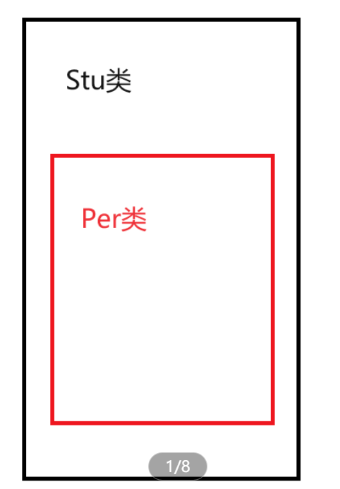

栈区：实例化类对象时，自动调用
堆区：什么时候使用new申请空间，什么时候调用构造函数

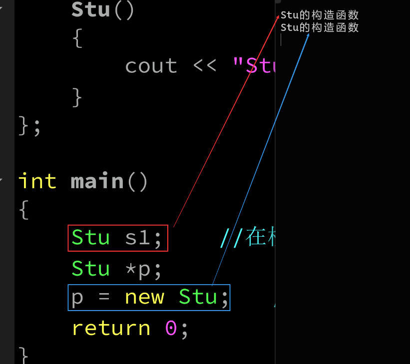

当提供构造函数后

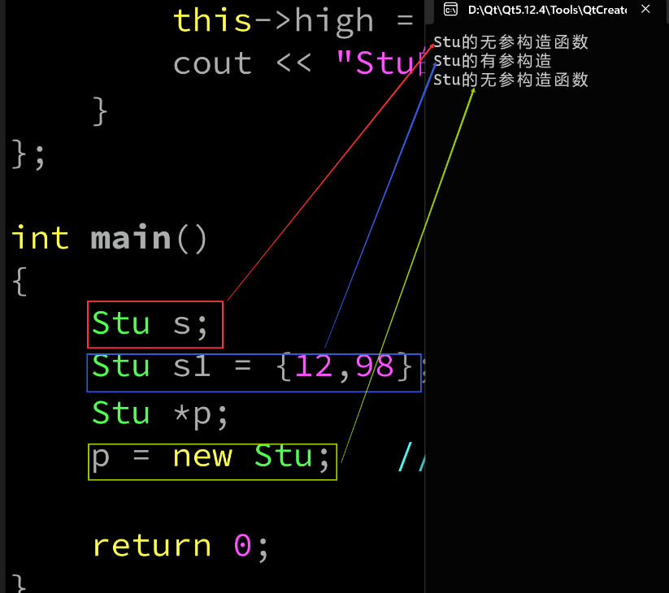

#### 构造函数提供了初始化列表的机制

如果在函数体内部，给成员属性赋值，是一个赋值的过程，不是初始化的过程

    类名():成员属性1(形参的值1),成员属性2(形参的值)`````

    在函数头后面，使用：引出初始化列表，每个成员属性以，分隔，()里面是形参，外面是成员属性

#### 需要使用初始化列表的情况

1.形参和成员属性同名
2.类中有引用成员时，必须使用初始化列表

```c++
#include <iostream>

using namespace std;
class Stu
{
    int age;
    float high;
    int &score;
public:
    //构造函数支持函数重载
    Stu(int age,float high,int a):age(age),high(high),score(a)
    {
        cout << "Stu的有参构造" << endl;
    }
};

int main()
{
    //Stu s;
    int n1 = 90;
    Stu s1(18,9,n1);    //在栈区
    Stu *p;
    //p = new Stu;   //在堆区申请了Stu类对象的空间

    return 0;
}
```
3.类中有const修饰的成员时，必须使用初始化列表
```c++
#include <iostream>

using namespace std;
class Stu
{
    int age;
    float high;
    const int score;
public:
//    Stu()
//    {
//        cout << "Stu的无参构造函数" << endl;
//    }
    //构造函数支持函数重载
    Stu(int age,float high,int a):age(age),high(high),score(a)
    {
        cout << "Stu的有参构造" << endl;
    }
};

int main()
{
    //Stu s;
    int n1 = 90;
    Stu s1(18,9,89);    //在栈区
    Stu *p;
    //p = new Stu;   //在堆区申请了Stu类对象的空间

    return 0;
}
```
4.类中含有其他类的子对象时，必须使用初始化列表(类的包含关系)
(如果另一个类只有有参构造需要在初始化列表中宏显性调用，如果另一个类有无参构造，可以不写初始化列表)

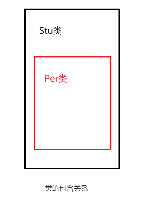

```c++
#include <iostream>

using namespace std;
class Per
{
    string name;
public:
    Per(string name)
    {
        this->name = name;
        cout << "Per的有参构造" << endl;
    }
};

class Stu
{
    int age;
    float high;
    int score;
    Per p1;   //Per类只有有参构造函数
public:
    Stu():p1("zhangsan")
    {
        cout << "Stu的无参构造函数" << endl;
    }
    //构造函数支持函数重载
    Stu(int age,float high,int a,string name):p1(name)
    {
        this->age = age;
        this->high = high;
        this->score = a;
        cout << "Stu的有参构造" << endl;
    }
};

int main()
{
    Stu s;
    int n1 = 90;
    Stu s1(18,9,89,"lisi");    //在栈区

    return 0;
}
```
### 析构函数

不支持函数重载
在类对象空间**消亡**时，系统自动调用

#### 格式

    ~类名()
    {
     //函数体
    }

#### 调用时机

    栈区：对象消亡时，自动调用
    堆区：什么时候delete，什么时候调用

**构造函数和析构函数调用的时机：**
先构造的后析构，后构造的先析构

#### 需要显性写出析构函数的场景

类中有指针成员，并且指针成员，指向堆区的空间

```c++
#include <iostream>

using namespace std;
class Stu
{
    string name;
    int *p;
public:
    Stu():p(new int)   //保证指针成员，指向堆区的空间
    {
        cout << "堆区申请的空间为:" << p << endl;
        cout << "Stu的无参构造" << endl;
    }
//    Stu(string name,int p):name(name),p(new int(p))
//    {
//        cout << "Stu的有参构造" << endl;
//    }
    ~Stu()
    {
        cout << "准备释放堆区的空间：" << p << endl;
        delete p;
        cout << "Stu的析构函数" << endl;
    }

};

int main()
{
    Stu s1;
    return 0;
}
```
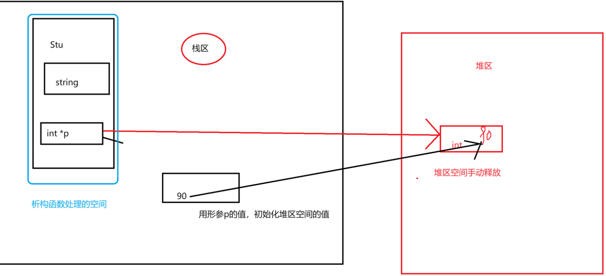

### 拷贝构造函数

利用一个类对象，给另一个类对象**初始化**时，自动调用拷贝构造函数
如果自己实现了拷贝构造，系统不再提供默认的拷贝构造

#### 格式

    类名(同类对象的引用)
    {
    //函数体
    }

#### 使用

```c++
#include <iostream>

using namespace std;
class Per
{
    string name;
public:

    //Per中，自己定义了有参构造，系统不再提供无参构造
    Per(string name)
    {
        this->name = name;
        cout << "Per的有参构造" << endl;
    }
    ~Per()
    {
        cout << "Per的析构函数" << endl;
    }
};

class Stu
{
    int age;
    float high;
    int score;
    //Per p1;   //Per类只有有参构造函数
public:
    Stu()
    {
        cout << "Stu的无参构造函数" << endl;
    }
    //构造函数支持函数重载
    Stu(int age,float high)
    {
        this->age = age;
        this->high = high;
        cout << "Stu的有参构造" << endl;
    }

    //拷贝构造
    Stu(Stu &other)
    {
        //this->age = other.age;
        this->high = other.high;
        cout << "拷贝构造函数" << endl;
    }
    ~Stu()
    {
        cout << "Stu的析构函数" << endl;
    }
    void show();
};
void Stu::show()
{
    cout << "age = " << age << endl;
    cout << "high = " << high << endl;
}
int main()
{
    Stu s1(19,100);
    cout << "s1的show:" << endl;
    s1.show();
    Stu s2=s1;
    cout << "s2的show:" << endl;
    s2.show();
    return 0;
}
```
#### 深浅拷贝问题**

当类中有指针成员，会涉及到深浅拷贝问题
浅拷贝：两个不同类对象的指针成员，指向同一片空间
问题：析构时，会发生二次释放问题；同一片空间被两个不同的类对象占用，发生资源抢占
深拷贝：两个不同类对象的指针成员，指向不同的空间，但是保存的是同样的数据

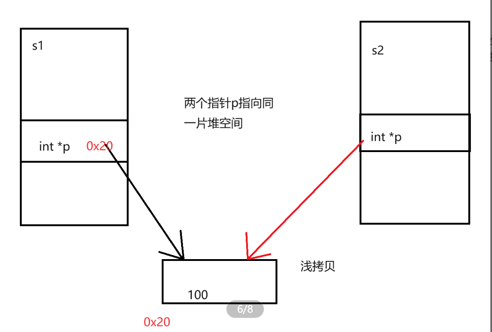

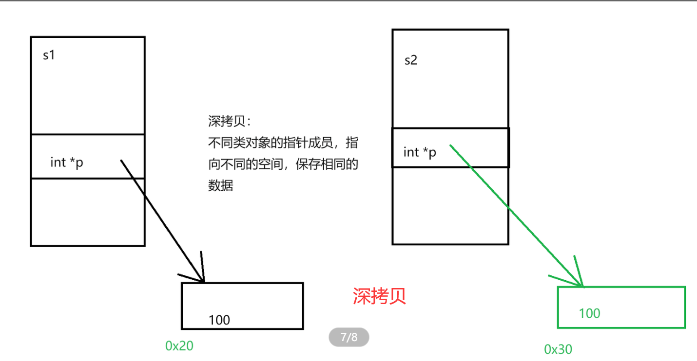

```c++
#include <iostream>

using namespace std;
class Stu
{
    string name;
    int *p;
public:
    Stu():p(new int)   //保证指针成员，指向堆区的空间
    {
        cout << "堆区申请的空间为:" << p << endl;
        cout << "Stu的无参构造" << endl;
    }
    Stu(string name,int p):name(name),p(new int(p))
    {
    }
    ~Stu()
    {
        cout << "准备释放堆区的空间：" << p << endl;
        delete p;

        cout << "Stu的析构函数" << endl;
    }

    //使用同类其他对象的指针成员解引用后的值，给自己的指针成员的内容初始化
    Stu(Stu &other):name(other.name),p(new int(*(other.p)))
    {
        /*this->name = other.name;
        this->p = new int(*(other.p));*/
        cout << "Stu的拷贝构造" << endl;
    }
    void show();
};
void Stu::show()
{
    cout << "name= " << name << endl;
    cout << "p= " << p << endl;
    cout << "*p= " << *p << endl;
}
int main()
{
    Stu s1("zhangsan",18);
    cout << "s1的show:" << endl;
    s1.show();
    Stu s2 = s1;
    cout << "s2的show:" << endl;
    s2.show();
    return 0;
}
```
#### 拷贝构造函数的调用时机

1.使用已有的类对象，给新的类对象初始化
2.函数的参数是一个类对象时，也会调用拷贝构造函数
3.函数的返回值是一个类对象时，也会调用拷贝构造函数

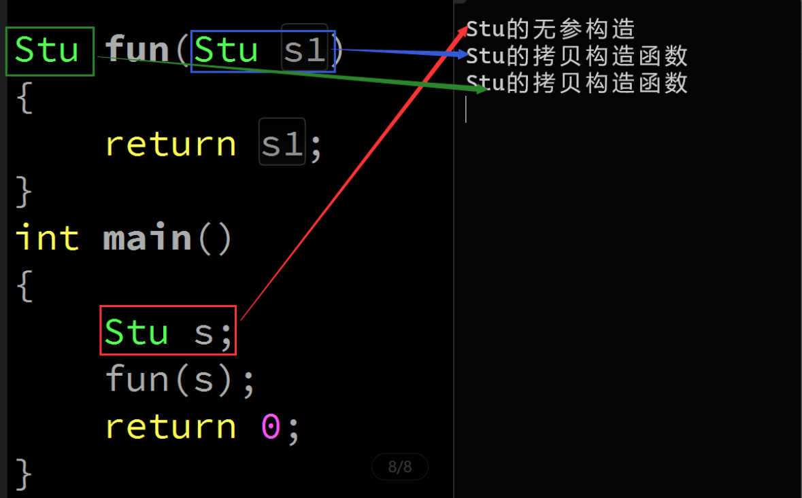

测试代码：

```c++
#include <iostream>

using namespace std;
class Stu
{
    string name;
public:
    Stu()
    {
        cout << "Stu的无参构造" << endl;
    }
    Stu(Stu &other):name(other.name)
    {
        cout << "Stu的拷贝构造函数" << endl;
    }
    Stu(string name):name(name)
    {
        cout << "Stu的右参构造" << endl;
    }
};

Stu fun(Stu s1)
{
    return s1;
}
int main()
{
    Stu s;
    //Stu s2(fun(s));   //会报错，因为fun(s)的返回值是一个临时值，不能引用
    return 0;
}
```

### 拷贝赋值函数

使用已有的类对象，给另外一个已有的类对象赋值
系统默认提供一个拷贝赋值函数
本质：赋值运算符的重载
#### 格式
    
    类名 &operator=(const 类名&other)
    {
    //函数体
    }

#### 代码

```c++
#include <iostream>

using namespace std;
class Stu
{
    string name;
    int *p;
public:

    //深拷贝赋值函数
    Stu &operator=(const Stu &other)
    {
        name = other.name;
        *p = *(other.p);
        cout << "Stu的拷贝赋值函数" << endl;
        return *this;
    }
    Stu():p(new int)   //保证指针成员，指向堆区的空间
    {
        cout << "堆区申请的空间为:" << p << endl;
        cout << "Stu的无参构造" << endl;
    }
    Stu(string name,int p):name(name),p(new int(p))
    {
    }
    ~Stu()
    {
        cout << "准备释放堆区的空间：" << p << endl;
        delete p;

        cout << "Stu的析构函数" << endl;
    }

    //使用同类其他对象的指针成员解引用后的值，给自己的指针成员的内容初始化
    Stu(Stu &other):name(other.name),p(new int(*(other.p)))
    {
        /*this->name = other.name;
        this->p = new int(*(other.p));*/
        cout << "Stu的拷贝构造" << endl;
    }
    void show();
};
void Stu::show()
{
    cout << "name= " << name << endl;
    cout << "p= " << p << endl;
    cout << "*p= " << *p << endl;
}
int main()
{
    Stu s1("zhangsan",18);
    cout << "s1的show:" << endl;
    s1.show();
    Stu s2;
    s2 = s1;
    cout << "s2的show:" << endl;
    s2.show();
    return 0;
}
```

### 匿名对象
没有对象名，通过类名实例化出来的对象
Stu()；生命周期更短


    1.全局函数传参
    2.类数组赋值     //int a=9,b=7,c=8;    int arr[3]={a,b,c};   //int arr[3]={9,7,8};
    3.临时调用类中的成员函数
    4.给新的类对象赋值

```c++
#include <iostream>

using namespace std;
class Stu
{
    string name;
    int *p;
public:

    //深拷贝赋值函数
    Stu &operator=(const Stu &other)
    {
        name = other.name;
        *p = *(other.p);
        cout << "Stu的拷贝赋值函数" << endl;
        return *this;
    }
    Stu():p(new int)   //保证指针成员，指向堆区的空间
    {
        cout << "堆区申请的空间为:" << p << endl;
        cout << "Stu的无参构造" << endl;
    }
    Stu(string name,int p):name(name),p(new int(p))
    {
    }
    ~Stu()
    {
        cout << "准备释放堆区的空间：" << p << endl;
        delete p;

        cout << "Stu的析构函数" << endl;
    }

    //使用同类其他对象的指针成员解引用后的值，给自己的指针成员的内容初始化
    Stu(const Stu &other):name(other.name),p(new int(*(other.p)))
    {
        /*this->name = other.name;
        this->p = new int(*(other.p));*/
        cout << "Stu的拷贝构造" << endl;
    }
    void show();
};
void Stu::show()
{
    cout << "name= " << name << endl;
    cout << "p= " << p << endl;
    cout << "*p= " << *p << endl;
}

void fun(Stu s1)
{
    cout << "调用成功" << endl;
}
int main()
{
    //1、使用匿名对象用做全局函数传参
    fun(Stu());   //匿名对象的生命周期，只在定义语句的位置，是一个临时值
    
    //2、想要临时使用类中的成员函数
    Stu().show();

    //3、给类对象的数组赋值
    Stu arr[3]={Stu("zhangsan",8),Stu("lisi",19),Stu("xiaoming",20)};

    //4、给新的类对象赋值
    Stu s3(Stu("zhangsan",18));
    return 0;
}

```

### C++中结构体和C的区别以及C++中结构体和类的区别

1. C中定义需要加struct，C++中可以不加struct
2. C++中结构体可以有访问权限的控制（public、private、protected）
3. C++中结构体可以继承
4. C++中结构体可以封装函数
5. C++中结构体内可以定义另外一个结构体声明(类型)

**结构体和类的区别：**

1. 使用场合不同，类适用于某一类对象属性和方法的封装，结构体用于某种数据结构的实现
2. 类中默认private，结构体中默认是public
3. 类默认是私有继承，结构体默认是共有继承
4. 类的封装性比结构体的封装性更好

**补充：常引用**
作用：保护目标不能通过引用修改

```c++
#include <iostream>
using namespace std;

int main()
{
    int a = 90;
    const int &r1 = a;  //常引用r1引用了a
    a = 100;    //可以通过变量本身修改自身
    //r1 = 20;  //不能通过常引用修改目标
    return 0;
}
```
### 类的大小

求法，和结构体大小求法一致
空类
class A
{};   ------>占1Byte的空间，因为空类也可以实例化类对象

## 友元  friend

如果A类中的函数，是B类的友元，(B声明的)，A中的函数可以访问B中的私有成员
### 友元函数
#### 类中的成员函数作为另一个类的友元函数
(蓝色的类的定义一定放在另一个前面)
1.需要把类做前置声明，但是类的前置声明只能说明，可以使用类定义变量/形参，并不能声明类中有哪些成员
2.如果一个类中的成员函数，作为另一个类的友元，**成员函数必须类内声明，类外定义**
3.如果A中的成员函数void show()，是B类的友元，需要在B中写friend void A::show();
#### 全局函数作为另一个类的友元函数
全局函数作为类的友元函数，用到哪一个类中的私有成员，就把全局函数的声明加上friend，放到哪一个类中就可以了
全局函数在类的声明下面

```c++
#include <iostream>

using namespace std;
class N2;
class N;

class N
{
    string name;
public:
    N(){cout << "无参构造" << endl;}
    N(string name):name(name){cout << "有参构造" << endl;}
    void show(N2 n);   //想要show函数作为N2类的友元函数，类内声明，类外定义
    void test_show();
    friend void fun(N &n1,N2 &n2);   //声明全局函数fun是N的友元函数
};

//N中的成员，可以访问N2中的内容
class N2
{
    int age;
public:
    N2(){}
    N2(int age):age(age){}
    void n2_show()
    {
        cout << "N2中的show函数" << endl;
        cout << this->age << endl;
    }
    friend void N::show(N2 n);  //完成了把N中的show函数，声明为了N2中的友元
    friend void fun(N &n1,N2 &n2);  //声明全局函数fun是N2的友元函数
};

//因为show是一个其他类的友元，所以要在类外定义
void N::show(N2 n)
{
    cout << "N中的show函数" << endl;
    cout << n.age << endl;   //访问另一个类N2中的私有成员
}
void fun(N &n1,N2 &n2)
{
    cout << "全局函数fun" << endl;
    cout << n1.name << endl;
    cout << n2.age << endl;
}
int main()
{
    N n1;
    N2 n(90);
    n1.show(n);
    fun(n1,n);
    return 0;
}
```
### 友元类
如果class A中，声明了friend  class B；A类把B类作为友元类
B中的所有成员都能访问A中的私有成员
在class B中，声明了friend class A，B类把A类作为友元类，
A类中所有成员可以访问B中的私有成员

**如果是声明友元类，就不涉及到类中成员的问题，写代码时，不需要考虑类的先后顺序**
```c++
#include <iostream>

using namespace std;
class N2;
class N;

class N
{
    string name;
public:
    N(){cout << "无参构造" << endl;}
    N(string name):name(name){cout << "有参构造" << endl;}
    void show(N2 n);   //想要show函数作为N2类的友元函数，类内声明，类外定义
    void test_show();
    friend void fun(N &n1,N2 &n2);  //在N中，声明全局函数fun为友元函数
};

//N中的成员，可以访问N2中的内容
class N2
{
    int age;
public:
    N2(){}
    N2(int age):age(age){}
    void n2_show();
    //friend void N::show(N2 n);  //完成了把N中的show函数，声明为了N2中的友元
    friend void fun(N &n1,N2 &n2); //在N2中，声明全局函数fun为友元函数
    friend class N;   //把N类，声明为N2类的友元类
};
void N2::n2_show()
{
    cout << "N2中的show函数" << endl;
}
//因为show是一个其他类的友元，所以要在类外定义
void N::show(N2 n)
{
    cout << "N中的show函数" << endl;
    cout << n.age << endl;   //访问另一个类N2中的私有成员
}
void fun(N &n1,N2 &n2)
{
    cout << "全局函数fun" << endl;
    cout << n1.name << endl;
    cout << n2.age << endl;
}
int main()
{
    N n1("zhangsan");
    N2 n(90);
    n1.show(n);   //此刻N并不是N2的友元类
    n.n2_show(n1);
    //fun(n1,n);
    return 0;
}
```

### 友元的注意事项
1.类的前置声明，只能表明有该类，并不能说明类中有哪些成员
2.如果成员函数，作为另一个的友元，需要类内声明，类外定义
3.友元是单向的，A声明了B为友元类，B中的成员可以访问A中私有成员，并不表示A中的成员，可以访问B中的私有成员
4.友元没有传递性，A :friend class B，B中：friend class C，并不能说明A把C当做友元类
5.友元会破坏类的封装性，谨慎使用友元 

**练习：**
1、定义两个类Dog和Cat类，分别由私有的成员属性：颜色、性别、年龄
写出两个类的无参构造和有参构造，定义一个全局函数：计算猫和狗的年龄之和，并输出。
定义Dog类为Cat类的友元，在Dog类中定义一个c_show函数，输出猫和狗的颜色。

```c++
#include <iostream>

using namespace std;
class animal_dog;
//驼峰命名法
class AnimalCat
{
private:
    string colour;
    string sex;
    int age;
public:
    AnimalCat(){}
    AnimalCat(string colour,string sex,int age):colour(colour),sex(sex),age(age)
    {}
    friend void add_age(AnimalCat &c1,animal_dog &d1);

    //声明Dog是Cat的友元类
    friend class animal_dog;
};

//下划线命名法
class animal_dog
{
private:
    string colour;
    string sex;
    int age;
public:
    animal_dog(){}
    animal_dog(string colour,string sex,int age):colour(colour),sex(sex),age(age)
    {}
    friend void add_age(AnimalCat &c1,animal_dog &d1);
    void c_show(AnimalCat &c1);  //输出猫和狗的颜色
};
void animal_dog::c_show(AnimalCat &c1)
{
    cout << "Dog的成员函数" << endl;
    cout << "狗的颜色:" << this->colour << endl;
    cout << "猫的颜色:" << c1.colour << endl;
}
void add_age(AnimalCat &c1,animal_dog &d1)
{
    cout << "全局的函数计算年龄和" << endl;
    cout << c1.age+d1.age << endl;
}
int main()
{
    AnimalCat cat("blue","m",18);
    animal_dog dog("black","f",5);
    add_age(cat,dog);  //全局函数的调用
    dog.c_show(cat);   //调用dog的成员函数，传猫类的对象
    return 0;
}
```

## 常成员函数和常对象
### 常成员函数

    const int add(int n1,int n2);  ----->const修饰函数的返回值
    常成员函数的定义： ----->在函数的参数后面加上const修饰
    返回值 成员函数()const;

**常成员函数的性质：**
1.常成员函数内，**不能**修改成员变量
2.可以保护成员变量不被随意修改
3.如果常成员函数的声明和定义分开，两个位置都要写上const修饰

**常成员函数的this指针：const 类名 *const this;**
### mutable

取消**常属性**
在类中给成员变量加上mutable关键字，就允许在常成员函数内修改成员变量
谨慎使用mutable
```c++
#include <iostream>

using namespace std;

class A
{
    int age;
    mutable string name;   //mutabel取消成员变量的常属性,可以在常成员函数中修改
public:
    void set_age(int age)
    {
        this->age = age;
    }

    void set_name(string name)const;

};
void A::set_name(string name)const
{
    //常成员函数内，不能修改成员属性的值
    this->name=name;
}
int main()
{
    A a1;
    a1.set_name("zhangsan");
    return 0;
}
```

### 常对象
实例化对象时，前面加上const关键字修饰
常对象的性质：
1.常对象只能调用常成员函数(默认调用的成员函数除外)
2.非常对象可以调用非常成员函数，也可以调用常成员函数
```c++
#include <iostream>

using namespace std;

class A
{
    int age;
    mutable string name;   //mutabel取消成员变量的常属性,可以在常成员函数中修改
public:
    A(int age,string name):age(age),name(name)
    {}
    A(){}
    void set_age(int age)
    {
        this->age = age;
    }

    void set_name(string name)const;

};
void A::set_name(string name)const
{
    //常成员函数内，不能修改成员属性的值
    this->name=name;
}
int main()
{
    const A a1(18,"lisi");
    A a2;
    a2.set_name("zhangsan");  //a2是非常对象，可以调用常成员函数
    //a1.set_age(90);   常对象只能调用常成员函数，
    return 0;
}
```

**练习：**
1、封装圆类Cir，私有属性半径R，圆周率PI，在程序运行过程中PI的值不变，写出圆的构造函数，公有的求面积函数
```c++
#include <iostream>

using namespace std;

class Cir
{
    int R;
    const float PI=3.14;
public:
    Cir(){}
    Cir(int r,float pi):R(r),PI(pi)
    {}
    Cir(int r):R(r)
    {}
    void show()const;
};
void Cir::show()const
{
    cout << "面积是：" << R*R*PI << endl;
}
int main()
{
    Cir c1(2,3.14);
    c1.show();
    return 0;
}
```

## 静态成员函数和静态成员变量
他们不依赖类对象存在，也不占用类的空间
### 静态成员变量(static)
1.静态成员变量，不依赖于类对象，独立于类体存在
2.每一个类对象公用同一个静态成员
3.即使没有实例化类对象，也可以使用类中的静态成员
4.静态成员一般是**public权限**
5.静态成员需要**在全局处声明**，声明的同时可以执行初始化操作，不初始化默认为0
6.格式：在类中：static  数据类型  成员名;
7.静态成员不占用类的大小
### 静态成员函数
1.不依赖于任何类对象，可以在没有类对象的情况下调用
2.静态成员函数，没有this指针，因为可以不通过类对象被调用
3.静态成员函数，**不能使用非静态成员变量**
4.调用方式：i)直接通过类名加域限定符调用，ii)通过类对象调用
5.非静态成员函数和静态成员函数可以构成重载
```c++
#include <iostream>

using namespace std;

class Stu
{
public:
    static int high;
    string name;
    static void show()
    {
        //cout << "name = " << name << endl;
        cout << "name = " << high << endl;
    }
    void show(string name)
    {
        
    }
};
int Stu::high;   //需要在全局处初始化
int main()
{
    Stu::show();
    cout << Stu::high << endl;
    Stu s1;
    s1.high = 80;
    Stu s2;
    s2.show();
    cout << s2.high << endl;
    cout << "s1.high" << &(s1.high) << endl;
    cout << "s2.high" << &(s2.high) << endl;
    cout << sizeof(Stu) << endl;
    return 0;
}
```

## 运算符重载
对于基本数据类型，可以直接运算，但是类不能直接参与运算，
没有对运算符进行重载
### 运算符重载函数名格式
    返回值  operator运算符(参数)
    {
    //函数体
    }

### 运算符重载的目的
让自己定义的类也能直接参与运算
**运算符重载的要求：**
1.不能创造运算符，必须对已有的运算符重载
2.不能更改运算符本身的功能，+运算重载后实现乘法运算
【3】运算符重载函数的格式
1.成员函数的格式：给哪个类重载运算符，就把重载函数定义为哪个类的成员函数
2.全局函数的格式：需要在类内声明全局函数为友元函数
**成员函数版**的运算符重载一定比全局函数版的运算符重载**少**一个参数，成员函数本身提供了一个类对象
### 算数运算符的重载
算术运算都是双目运算：
格式：L # R  ---->需要两个类对象作为参数
结果：右值
参数：运算过程中不需要修改操作数，可以定义为const
### 赋值运算符的重载
operator= :拷贝赋值函数
+=、-=···运算符的重载
格式：L # R
结果：对左操作数的修改，是一个左值
参数：左操作数运算过程中可以修改，右操作数不能修改
### 条件运算符的重载
<   >·····
格式：L # R
结果：bool类型的真值或者假值
参数：运算过程中不需要修改操作数，可以定义为const
bool operator>(Complex &c1,Complex &c2)
{}
### （）运算符的重载
1.对()运算符，调用函数的性质重载
2.对()强转的性质重载    float a;  int(a);
格式：operator 数据类型(){}    ---->因为强转类型已经明确了返回值类型
### 自增自减运算符的重载
a++、 ++a、
前自增：
	成员函数：Complex &operator++(){}
	全局函数：Complex &operator++(Complex &c1){}
后自增： ----->需要使用**哑元**和前自增区分
	成员函数：Complex &operator++(int){}
	全局函数：Complex &operator++(Complex &c1,int){}
### 插入/提取运算符的重载***
(输入输出运算符)
int a;  cout << a<< endl;
返回值 operator<<(){}   成员函数版的提取运算符
c4.operator<<(cout)   调用格式，不符合日常使用
cout << c4;

cout<<本身有一个可以级联输出的性质，重载后也要求能实现这个性质
cout << a << b; --->  operator<<(cout,a) << b  ----->说明函数的返回值是cout
```c++
#include <iostream>

using namespace std;

class Complex
{
    int real;
    int vir;
public:
    Complex(){}
    Complex(int real,int vir):real(real),vir(vir){}
    //输出类对象的成员
    void show()
    {
        cout << real << "+" << vir << "i" << endl;
    }
    friend Complex operator-(const Complex &c1,const Complex &c2);
    //成员函数版的+运算符重载
    Complex operator+(const Complex &other)
    {
        Complex temp;
        temp.real = this->real+other.real;
        temp.vir = this->vir+other.vir;
        return temp;
    }
    //成员函数版的混合赋值运算符重载
    Complex operator+=(const Complex &c1)
    {
        this->real = this->real+c1.real;
        this->vir = this->vir+c1.vir;
        return *this;
    }
    friend bool operator==(const Complex &c1,const Complex &c2);

    //使用成员函数，实现强转功能的重载 int()
    //强转功能重载的固定格式,只有成员函数版的重载函数
    //operator 类型()
    operator int()
    {
        return this->real;
    }

    //重载()运算符,调用函数功能的()
    //实现了一个伪函数
    void operator()()
    {
        cout << 123 << endl;
    }
    void operator()(string name)
    {
        cout << name << endl;
    }
    friend Complex &operator--(Complex &c1,int);

    //成员函数版的前自增
    Complex &operator++()
    {
        ++this->real;
        ++this->vir;
        return *this;
    }
    friend ostream &operator<<(ostream &out,Complex &c1);
};

//全局函数版实现后自减运算符的重载
Complex &operator--(Complex &c1,int)
{
    static Complex temp = c1;   //使用temp获取自减前的值
    c1.real--;
    c1.vir--;
    return temp;  //返回自减前的值
}
//全局函数版-运算符重载
Complex operator-(const Complex &c1,const Complex &c2)
{
    Complex temp;
    temp.real=c1.real-c2.real;
    temp.vir=c1.vir-c2.vir;
    return temp;
}
//全局函数版的==运算符重载
bool operator==(const Complex &c1,const Complex &c2)
{
    return c1.real==c2.real&&c1.vir==c2.vir;
}

//全局函数实现提取运算符的重载
ostream &operator<<(ostream &out,Complex &c1)
{
    out << c1.real << "+" << c1.vir << "i" << endl;
    return out;
}
int main()
{
    Complex c1(3,5);
    Complex c2(1,4);
    c1.show();
    c2.show();
    Complex c3 = c1+c2;
    /*c3.show();
    c2+=c1;    //左调右参，c2调用了混合运算符重载，参数是c1
    c2.show();
    c2();
    c2("zhangsan");
*/
    Complex c4 = c3--;

    cout << c4 << c3 << 3 << endl;
    //cout << c4 --->operator<<(cout,c4)--->返回值cout
    //operator<<(cout,c4)<<c3
    //operator<<(operator<<(cout,c4),c3) << 3

    //ostream &operator<<(ostream &out,Complex &c1){}
    int a=9,b =3;
    //cout << a << b;   //先输出a再输出b  //operator<<(cout,a)<<b
    //operator<<(cout,a)  ---->会返回一个cout继续输出
    //cout是ostream类的类对象，自己不能不能定义，但是可以通过引用传入函数再返回
    //cout应该是ostream类的类对象

    return 0;
}
```
### 不能重载的运算符

1.sizeof()
2.成员访问运算符.    
3.指针访问运算符  *  ---->对指针访问
4.::  域限定符
5.a?a:b   （三目运算）

##面向对象的三大特征

封装、继承和多态

## 继承

一个类，继承另一个已有的类，创建的过程
父类(基类)派生出子类(派生类)的过程
继承提高了代码的复用性
### 继承的格式

    class 类名:父类名
    {};

### 继承的权限
    
    class 类名:继承的权限 父类名
    {};

    如果不写继承方式，默认是私有继承

```c++
父类中的权限      public|private|protected  public|private|protected   public|private|protected              
继承方式                 public                    private                   protected
子类中的权限      public|不能访问|protected  private|不能访问|private    protected|不能访问|protected
```
### 继承时类中的特殊成员函数
特殊的成员函数不会被继承
**构造函数:**
**●需要在子类中显性调用父类的构造函数(初始化列表中)(透传构造)
●透传构造
●继承构造
●委托构造**

需要在子类中显性调用父类构造函数的场合:
父类中只有有参构造  ----->子类在创建类对象时，必须手动调用父类的构造函数

```c++
#include <iostream>

using namespace std;

class Father
{
public:
    int age;
    char c;
    Father(int a,char c):age(a),c(c){cout << "Father有参" << endl;}
};

class Child:public Father    //----->私有继承
{
    int high;
public:
    void show()
    {
        cout << c << endl;
    }
};

int main()
{
    //Child c1;  //error，因为父类只有有参构造，而子类中没有提供能够调用父类有参构造的构造函数，不能成功创建父类的空间
    //Father f1;
    c1.age;
    cout << sizeof (Father) << endl;
    cout << sizeof (Child) << endl;
    return 0;
}
```


#### 透传构造
在子类构造函数的初始化列表中，显性调用父类的构造函数

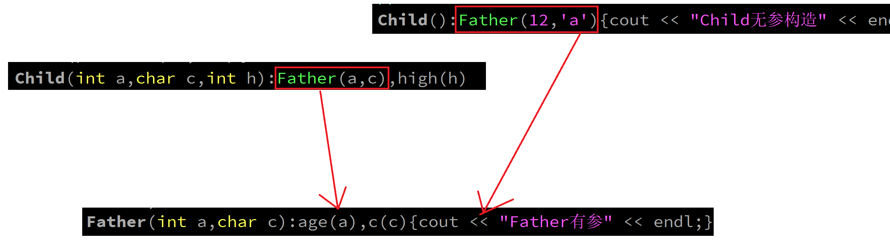

#### 继承构造
C++支持
不用在子类中再写一遍父类的构造函数
使用：using Father::Father； ----->在子类中使用父类的构造函数
直接使用继承构造的方式，**不能对子类成员初始化**

继承构造本质上并不是把父类中的构造函数继承给子类，编译器自动根据父类中构造函数的格式，提供出派生的构造函数(个数和参数都和父类中的构造函数一致)，主要还是通过透传构造创建父类的空间
    
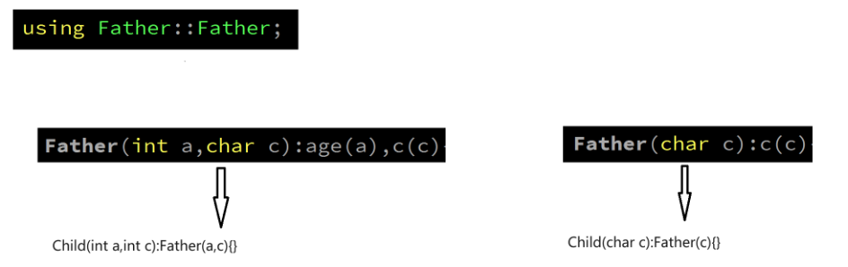

```c++
#include <iostream>
using namespace std;

class Father
{
public:
    int age;
    char c;
//    Father(){cout << "Father无参" << endl;}
    Father(int a,char c):age(a),c(c){cout << "Father有参两个参数" << endl;}
    Father(char c):c(c){cout << "Father有参一个参数的" << endl;}
    Father(Father &other):age(other.age),c(other.c)
    {cout << "Father拷贝" << endl;}
};

class Child:public Father    //----->私有继承
{
private:
    int high;
    //父类中的public成员age，通过公有继承，仍然是public
    using Father::age;   //把父类中公有继承下来的age成员，在子类中改成私有权限
public:
    void show()
    {
        cout << c << endl;
    }
    //子类的无参构造，但是显性调用父类的有参构造还给了默认值
    //透传构造
//    Child():Father(12,'a'){cout << "Child无参构造" << endl;}
//    Child(int a,char c,int h):Father(a,c),high(h)
//    {cout << "Child有参构造" << endl;}

    //父类中的所有构造函数，都被继承到了子类中
    using Father::Father;   //更高效一些
};

int main()
{
    Child c1(10);
    Child c2(20,'z');
    Child c3 = c2;
    //Father f1;
    //c1.age;
    cout << sizeof (Father) << endl;
    cout << sizeof (Child) << endl;
    return 0;
}
```
#### 委托构造
一个类的情况，并不直接通过无参构造实例化对象，而是无参构造委托了有参构造，实例化对象

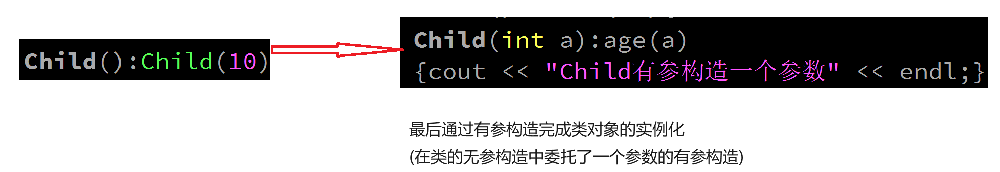

继承时的情况

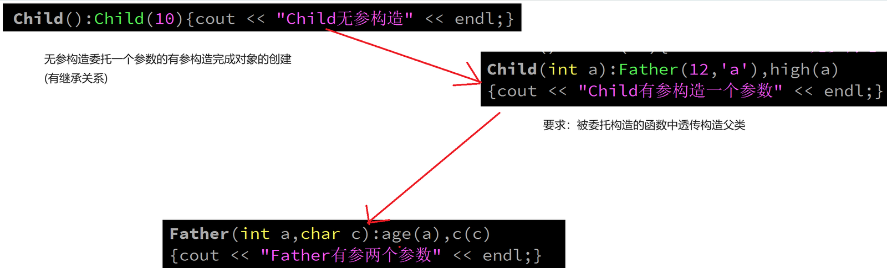

```c++
    Child():Child(10){cout << "Child无参构造" << endl;}   //Child c1
    Child(int a):Father(12,'a'),high(a)
    {cout << "Child有参构造一个参数" << endl;}
```

#### 拷贝构造
需要在初始化列表中显性调用父类的拷贝构造，传other对象到父类的拷贝构造中
```c++
Father(Father &other):age(other.age),c(other.c){cout << "Father的拷贝构造" << endl;}
Child(Child &other):Father(other),high(other.high){}
```

### 继承时构造和析构的时机
继承关系，可以理解为包含关系
子类在继承父类时，会把父类中的成员保留一份，再来创建子类自己的成员

父类先构造，子类后构造
子类先析构，父类后析构
```c++
#include <iostream>

using namespace std;
class F
{
    int *p;
public:
    F():p(new int){cout << "F无参构造" << endl;}
    ~F()
    {
        delete p;
        cout << "F析构函数" << endl;
    }
};
class C:public F
{
    int *p;
public:
    C():p(new int){cout << "C无参构造" << endl;}
    ~C()
    {
        delete p;
        cout << "C析构函数" << endl;
    }
};

int main()
{
    C *p1 = new C;
    delete p1;   //空间释放时，会自动调用析构函数，无需手动调用
    p1 = nullptr;
    return 0;
}
```
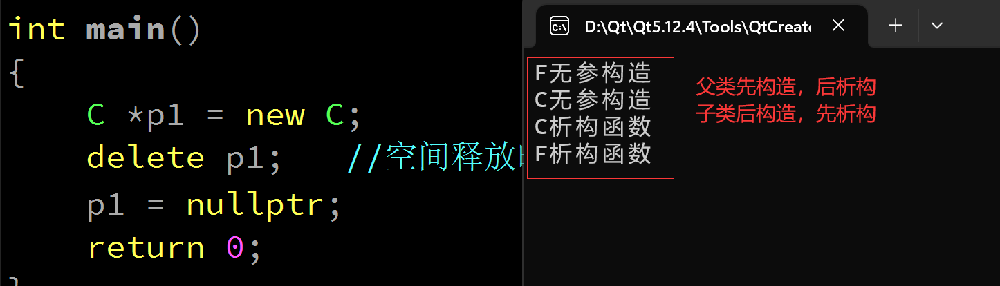

### 父子类中存在同名成员问题
访问时不会发生冲突，默认访问子类的
```c++
#include <iostream>
using namespace std;
class F
{
public:
    int *p;
    F():p(new int){cout << "F无参构造" << endl;}
    ~F()
    {
        delete p;
        cout << "F析构函数" << endl;
    }
};
class C:public F
{
public:
    int *p;
    C():p(new int){cout << "C无参构造" << endl;}
    ~C()
    {
        delete p;
        cout << "C析构函数" << endl;
    }
};

int main()
{
    C *p1 = new C;
    *(p1->p) = 90;
    cout << *(p1->p) << endl;   //子类成员和父类成员同名，默认优先访问子类成员
    cout << *(p1->F::p) << endl;  //通过域限定符访问父类的成员
    delete p1;   //空间释放时，会自动调用析构函数，无需手动调用
    p1 = nullptr;
    return 0;
}
```

## 多重继承
一个子类，继承自多个基类

### 格式

    class 类名:继承权限 父类名,继承权限 父类名····
    {}

### 当多个父类中包含同名成员
多个父类中包含同名成员，通过域限定符访问指定的父类中成员
```c++
#include <iostream>

using namespace std;

class Room
{
public:
    void clean()
    {
        cout << "打扫房间" << endl;
    }
};
class BedRoom
{
public:
    void play()
    {
        cout << "可以玩游戏" << endl;
    }
    void clean()
    {
        cout << "打扫卧室" << endl;
    }
};

//Home类公共继承字Room和BedRoom类
class Home:public Room,public BedRoom
{
};

int main()
{
    Home h1;
    h1.play();
    h1.Room::clean();
    h1.BedRoom::clean();
    return 0;
}
```

## 菱形继承(钻石继承)
### 格式

      A                ----->公共基类
    /   \
    B    C             ------>中间子类
    \   /
      D                ------>汇集子类

汇集子类中，会包含两份公共基类中的内容

### 菱形继承存在的问题

1.会发生二义性的问题(同一个变量或者函数，可以通过两种方法访问)
2.如果公共基类，过大，会造成汇集子类中的代码膨胀/冗余

```c++
#include <iostream>

using namespace std;
class A
{
public:
    int a;
    //A(int a):a(a){cout << "A" << endl;}
};

class B:public A
{
public:
    int c;
    //B(int a,int c):A(a),c(c){cout << "B" << endl;}
};

class C:public A
{
public:
    //C(int a):A(a){cout << "C" << endl;}
};

class D:public C,public B
{
public:
    //D(int a,int c):B(a,c),C(a),A(a){cout << "D" << endl;}
};

int main()
{
    D d1;
    d1.B::a = 90;   //二义性，还可以直接通过中间子类访问，直接访问B中的a成员
    //cout << d1.C::A::a << endl;  //会发生二义性，因为访问A，但是有两条路径都访问到A
    return 0;
}
```

### 虚继承(virtual)**
虚继承指对公共基类的虚继承。

主要用于解决菱形继承问题，
采用虚继承后，公共基类中的内容，只会在汇集子类中存在一份，在汇集子类中，可以通过任意一条路径访问到公共基类中的成员

```c++
#include <iostream>

using namespace std;
class A
{
public:
    int a;
};

class B:virtual public A
{
public:
    int c;
};

class C:virtual public A
{

};

class D:public B,public C
{

};

int main()
{
    D d1;
    d1.B::A::a = 90;
    cout << d1.C::A::a << endl;
    return 0;
}
```

**练习：**
1、写出菱形继承下，每一个类的构造函数
B和C哪一个先构造，取决于D在继承时的顺序
```c++
#include <iostream>

using namespace std;
class A
{
public:
    int a;
    A(int a):a(a){cout << "A" << endl;}
};

class B:virtual public A
{
public:
    int c;
    B(int a,int c):A(a),c(c){cout << "B" << endl;}
};

class C:virtual public A
{
public:
    C(int a):A(a){cout << "C" << endl;}
};

class D:public C,public B
{
public:
    D(int a,int c):B(a,c),C(a),A(a){cout << "D" << endl;}
};

int main()
{
    D d1(12,4);
    d1.B::A::a = 90;
    cout << d1.C::A::a << endl;
    return 0;
}
```

## 多态
常说的多态，是发生在类之间的多态
函数重载(静态多态/编译时多态)
类之间的多态(动态多态/运行时多态)
### 前提

**继承是多态的前提
虚函数**
什么是多态：相同的代码，实现不同的功能

### 函数重写(override)

    1.必须有继承关系
    2.父类中必须有虚函数

在子类中重写父类的虚函数就是函数重写的过程，可以实现多态

### 虚函数(virtual)
**只要基类中是虚函数，后面的所有子类中该函数都是虚函数**
常规来说，在继承时，给父类中的函数加上virtual关键字，定义成一个虚函数，
在子类中，可以对父类中的虚函数进行函数重写(override)

只要有虚函数的类，都会有一个虚函数表和一个虚(函数表)指针
虚指针是指向虚函数表的指针；
虚函数表，存储所有的虚函数的信息

**虚函数表**：保存所有虚函数的入口地址，**每一个**包含虚函数的**类都会有一张虚函数表**，
如果发生继承关系，**子类**会**先复制父类**的虚函数表，如果子类对某个**虚函数重写**，就去**更改**虚函数表中，该函数的入口地址

**虚函数表指针**：指向虚函数表的指针，父类中有一个虚函数表指针，子类中的虚函数表指针是从父类中继承下来的虚函数表指针，指向子类的虚函数表(虚函数表指针存在类中的第一个位置)

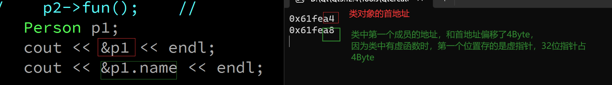

### 虚析构函数
由于实现多态，需要使用父类的指针，指向子类的空间，父类指针可以操作的空间，只有父类自己的部分，所以，在delete父类指针时，并不会释放调子类的空间

解决方法：给基类(父类)的析构函数前面加上virtual关键字，只要基类是虚析构函数，后面继承的所有子类都是虚析构函数，虚析构函数会引导父类的指针，释放掉子类的空间

```c++
#include <iostream>

using namespace std;
class Person
{

public:
    string name;
    virtual void play()
    {
        cout << "吃饭" << endl;
    }
    virtual void fun()
    {
        cout << "fun" << endl;
    }
    virtual ~Person()
    {
        cout << "Person的析构" << endl;
    }
};

class Stu:public Person
{
    int age;
public:
    void play()   //在子类中，对父类中的play进行函数重写
    {
        cout << "打游戏" << endl;
    }
    ~Stu()
    {
        cout << "Stu的析构" << endl;
    }
};
class S:public Stu
{
public:
    void play()
    {
        cout << "第二次继承" << endl;
    }
    void fun()
    {
        cout << "fun的第二次继承" << endl;
    }
};
int main()
{
    //父类的指针，指向子类的空间，可以调用子类中重写的函数(多态的实现)
    Person *p = new Stu;
    p->Person::play();
    delete p;
//    p->play();
//    Person *p1 = new S;
//    p1->play();   //第二次继承
//    p1->fun();    //fun的第二次继承
//    Person *p2 = new Stu;
//    p2->fun();    //

    return 0;
}
```


