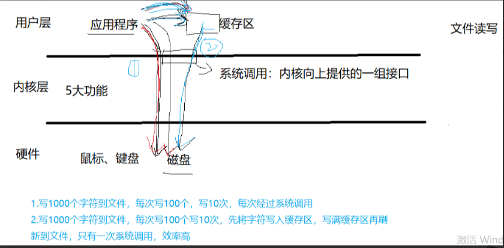
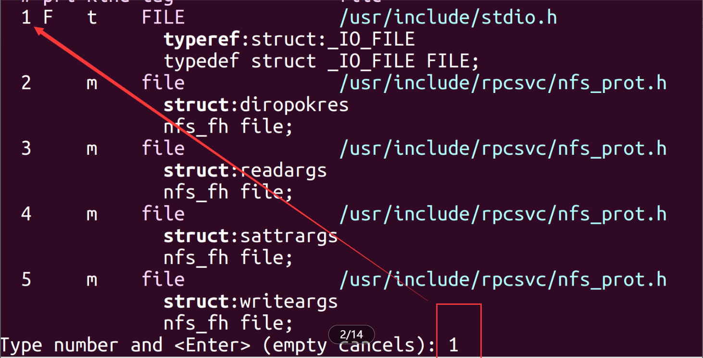
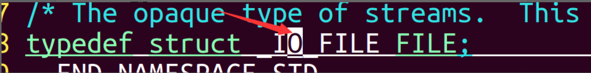
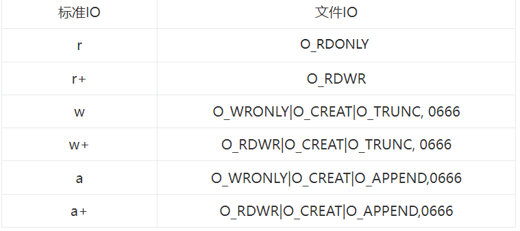
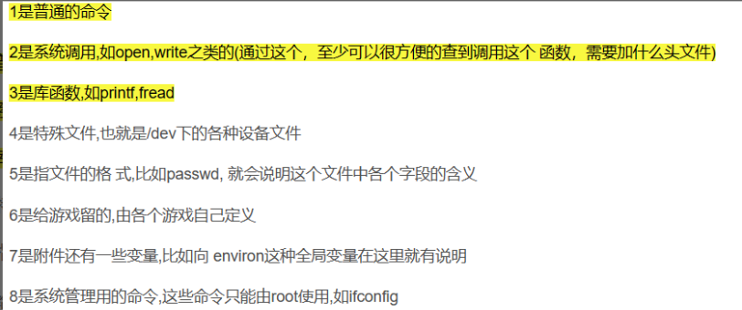
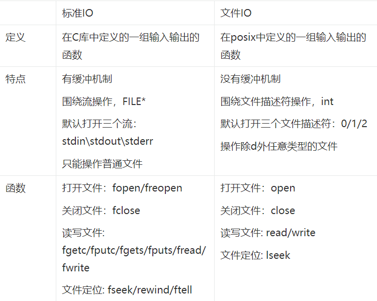
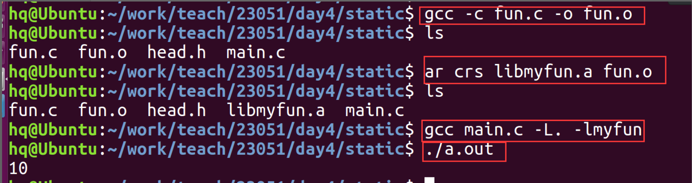
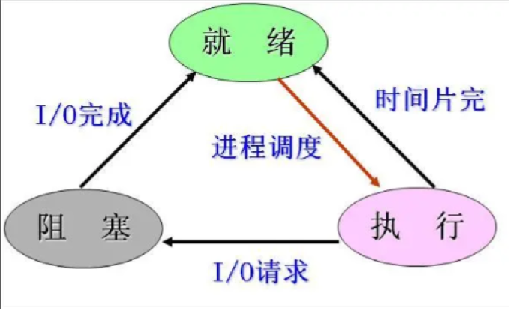
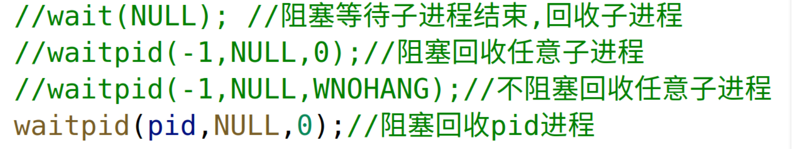

#IO
##标准IO
文件：Linux系统中7种文件类型，b(块设备文件)、s(套接字文件)、p(管道文件)、-(普通文件)、l(链接文件)、c(字符设备文件)、d(目录文件)

###概念
>在C语言标准库中定义的一组用于输入输出的函数(API)

###特点
```c
    1.有缓冲机制,通过缓冲机制减少系统调用的次数，提高效率
    2.围绕文件流进行操作，流用**FILE***描述，FILE表示结构体，包含文件的信息
    3.默认打开了三个流：stdin(标准输入)、stdout(标准输出)、stderr(标准错误)
    4.只能操作普通文件
```




**vi -t FILE 追数据类型、宏定义的源码**

**CTRL+]:向下追源码 CTRL+T回退 q退出**


###缓存区
```c
    全缓存：和文件相关
        刷新缓存的条件:
            程序正常结束
            缓存区满刷新
            fflush强制刷新
    行缓存：和终端相关
        刷新缓存的条件:
            \n刷新
            程序正常结束
            缓存区满刷新
            fflush强制刷新
    不缓存：没有缓存区，标准错误(stderr)
```
**小练习：计算缓存区大小**
>```c
>#include <stdio.h>
>int main(int argc, char const *argv[])
>{
>    for (int i = 0; i < 300; i++)
>    {
>        printf("%4d",i);
>    }
>    while(1);
>        return 0;
>}
>//用FILE结构体成员
>#include <stdio.h>
>int main(int argc, char const *argv[])
>{
>    printf("于雪杰给我死");
>    printf("%d\n",stdout >->_IO_buf_end - stdout >->_IO_buf_base);    
>    return 0;
>}
>```
###函数接口
####打开文件 fopen
```c
   FILE *fopen(const char *path, const char *mode)
   功能：打开文件
   参数：
        path：打开的文件
        mode：打开的方式
            r/rb：只读，当文件不存在时报错，文件流定位到文件开头
            r+/r+b：可读可写，当文件不存在时报错，文件流定位到文件开头
            w/wb：只写，文件不存在创建，存在清空
            w+/w+b：可读可写，文件不存在创建，存在清空
            a/ab：追加(在末尾写),文件不存在创建，存在追加，文件流定位到文件末尾
            a+/a+b：读和追加，文件不存在创建，存在追加，读文件流定位到文件开头，写文件流定位到文件末尾
                注：当a的方式打开文件时，写只能在末
                进行追加，定位操作是无法改变写的位置，但是可以改变读的位置
   返回值：成功：文件流
    失败：NULL，并且会设置错误码
```
####打印详细错误信息
```c
    void perror(const char *s);
    功能：根据errno值打印对应的错误信息
    参数：
        s:提示语句
    返回值：空
```

####关闭文件 fclose
```c
   int fclose(FILE* stream);
   功能：关闭文件
   参数：stream：文件流

```

**实现**
```c
#include <stdio.h>

int main(int argc,char const *argv[])
{
    FILE *fp = NULL;
    if ((fp=fopen("./hello.c","r")) == NULL)
    {
        perror("fopen err");
        return -1;
    }
    printf("fopen success\n");
    fclose(fp);
    return 0;
} 
```
####读写操作 fgetc fputc (字串单个读写)

```c
   int  fgetc(FILE * stream)
   功能：从文件中读取一个字符
   参数：stream：文件流
   返回值：成功：读到的字符
        失败或读到文件末尾：EOF(-1)

   int fputc(int c, FILE * stream)
   功能：向文件中写入一个字符
   参数：c：要写的字符
        stream：文件流
   返回值：成功：写的字符的ASCII
          失败：EOF

```
####出错检测(权限不够时)
```c
    int ferror(FILE * stream);
    功能:检测文件有没有出错
    返回：文件出错，返回非零值
```
####判断文件到结尾
```c
int  feof(FILE * stream);
功能：判断文件有没有到结尾
返回：到达文件末尾，返回非零值
```
**练习：通过fgtec fputc实现cat功能 cat文件名 ->./a.out 文件名**
思路：打开文件，循环读文件(fgetc)，当读到文件末尾时(fgetc返回值是EOF)循环结束，循环中打印读到的字符，关闭文件
```c
#include <stdio.h>
int main(int argc,char const *argv[])
{
    if(argc != 2)
    {
        printf("please input %s <filename>",argv[0]);
        return -1;
    }
    FILE *fp = NULL;
    if( (fp = fopen(argv[1],"r")) == NULL)
    {
        perror("fopen err");
        retur -1;
    }
    int num;
    while(1)
    {
        num = fgetc(fp);
        //if(num == EOF)
        //break;
        if(feof(fp))
        break;
        fputc(num,stdout);
    }
    // while((ch = fgetc(fp)) !=EOF)
    //     printf("%c",ch);
    fclose(fp);
    return 0;
}

```
####字符串读写 fgets fputs

```c
    char * fgets(char *s,  int size,  FILE * stream);
    功能：从文件中每次读取一行字符串
    参数：s：存放字符串的地址
        size：一次读取的字符个数
        stream：文件流
    返回值：成功：s的地址
        失败或读到文件末尾：NULL
    特性：1.实际读取size-1个字符,在末尾添加\0 
          2.读到\n结束读取 同时能获取到'\n'
          3.防止越界问题
          gets 会一直取，有多少取多少

    int  fputs(const char *s,  FILE *stream);
    功能：向文件中写字符串
    参数：s：要写的内容
        stream：文件流
    返回值：成功：非负整数
       失败：EOF

```
**练习：通过fgets实现"wc -l 文件名"命令功能（计算文件行数）**
```c
    #include <stdio.h>
    #include <string.h> 
    int main(int argc,char const *argv[])
    {
        char buf[32];
        int num =0;
        FILE *fp = NULL;
        if( (fp = fopen(argv[1],"r+")) == NULL)
        {
            perror("fopen err");
            return -1;
        }
        while(fgets(buf,32,fp)!=NULL)
        {
            if(buf[strlen(buf)-1] == '\n')
            num++;
        }
        printf("%d %s\n",num,argv[1]);
        fcolse(fp);
        return 0;
    }
```
**练习：实现“head -n 文件名”命令的功能**
```c
#include <stdio.h>
#include <string.h>
#include <stdlib.h>
int main(int argc, char const *argv[])
{
    FILE *fp = fopen(argv[1], "r+");
    if (NULL == fp)
    {
        perror("fopen err\n");
        return -1;
    }
    char buf[128];
    int num = atoi(argv[2] + 1);
    for (int i = 0; i < num; i++)
    {
        fgets(buf, 128, fp);
        fputs(buf, stdout);
    }
    return 0;
}
```
####重定向 fopen  freopen
```c
FILE * freopen(const char *pathname,  const char *mode,  FILE* fp)
功能：将指定的文件流重定向到打开的文件中
参数：path：文件路径
mode：打开文件的方式（同fopen）
      fp：文件流指针
返回值：成功：返回文件流指针
      失败：NULL
```
**实现**
```c
#include <stdio.h>
int main(int argc,char const *argv[])
{
    printf("hello word\n");
    //将标准输出流重定向到文件里
    if(freopen(argv[1],"w+",stdout) ==NULL)
    {
        perror("freopen err");
        return -1;
    }
    printf("heelo\n");
    printf("world\n");
    //将标准输出流重定向到终端
    freopen("/dev/tty","r+",stdout);
    printf("I LOVE CHINE\n");
}
```
####二进制读写
```c
size_t fread(void *ptr, size_t size, size_t nmemb, FILE *stream);
功能：从文件流读取多个元素
参数：	ptr ：用来存放读取元素
        size ：元素大小  sizeof(数据类型)
		nmemb ：读取对象的个数
		stream ：要读取的文件
返回值：成功：读取对象的个数
      读到文件尾： 0
       失败： -1
size_t fwrite(const void *ptr, size_t size, size_t nmemb, FILE *stream);
功能：按对象写
参数：同上	
返回值：成功：写的元素个数
      失败 ：-1
Fread和fwrite函数注意：
1）两个函数的返回值为：读或写的对象数
2）对于二进制数据我们更愿意一次读或写整个结构。
```
**实现**
```c
#include <stdio.h>

int main(int argc,char const *argv[])
{
    FILE *fp = NULL;
    if( (fp = fopen(argv[1],"w+")) == NULL)
        {
            perror("fopen err");
            return -1;
        }
    char buf[3] = {'2','3','4'};
    fwrite(buf,sizeof(char),3,fp);
    rewind(fp);
    char buff[3];
    fread(buff,sizeof(char),3,fp);
    printf("%c %c %c\n",buff[0],buff[1],buff[2]);
    fclose(fp);
    return 0;
}
```
####定位操作 fseek ftell rewind
```c
void rewind(FILE *stream);
功能：将文件位置指针定位到起始位置
int fseek(FILE *stream, long offset, int whence);
功能：文件的定位操作
参数：stream：文件流
     offset：偏移量：正数表示向后文件尾部偏移，负数表示向文件开头偏移
     whence：相对位置：
           SEEK_SET:相对于文件开头
           SEEK_CUR:相对于文件当前位置
           SEEK_END:相对于文件末尾
返回值：成功：0
        失败：-1   
注：当打开文件的方式为a或a+时，fseek不起作用   
long ftell(FILE *stream);
功能：获取当前的文件位置
参数：要检测的文件流
返回值：成功：当前的文件位置，出错：-1
```
**实现标准IO cp功能 命令行传参**
```c
#include <stdio.h>

int main(int argc,char *argv[])
{
    FILE *fp = NULL,*fpp==NULL;
    if((fp = fopen(argv[1],"r"))==NULL)
    {
        perror("fdp fopen err");
        return -1;
    }
    if((fpp = fopen(argv[2],"w+"))==NULL)
    {
        perror("fpp fopen err");
        return -1;
    }
    char buf[32]={0};
    size_t num;
    while((num=fread(buf,1,32,fp)) != 0)
    {
        fwrite(buf,1,num,fpp);
    }
    close(fp);
    close(fpp);
    return 0;
    }
```
##文件IO
###概念
>在系统中定义的一组用于输入输出的函数
###特点
```c
1. 没有缓冲机制，每次IO操作都会引起系统调用
2. 围绕文件描述符进行操作，文件描述符是非负整数，从0开始依次分配
3. 默认打开了三个文件描述符：0(标准输入)、1(标准输出)、2(标准错误)
4. 可以操作除d以外任意类型的文件
```
###函数接口
####打开文件open
```c
int open(const char *pathname, int flags);
功能：打开文件
参数：pathname：文件路径名
      flags：打开文件的方式
            O_RDONLY：只读
            O_WRONLY:只写
            O_RDWR：可读可写
            O_CREAT:创建
            O_TRUNC：清空
            O_APPEND：追加   
返回值：成功：文件描述符
        失败：-1
当第二个参数中有O_CREAT选项时，需要给open函数传递第三个参数，指定创建文件的权限 
int open(const char *pathname, int flags, mode_t mode);
创建出来的文件权限为指定权限值&(~umask)  //umask为文件权限掩码
```
**指定权限值&(~umask)  0666&（~0002）   0666&0775   0664**
####标准IO和文件IO打开方式对应关系

####关闭文件close
```c
int close(int fd);
功能：关闭文件
参数：fd：文件描述符
```
####读写操作read、write
```c
ssize_t read(int fd, void *buf, size_t count);
功能：从一个已打开的可读文件中读取数据
参数：fd  文件描述符
          buf  存放位置
         count  期望的个数
返回值：成功：实际读到的个数
              返回-1：表示出错,并设置errno号
              返回0：表示读到文件结尾	
ssize_t write(int fd, const void *buf, size_t count);
功能：向指定文件描述符中，写入 count个字节的数据。
参数：fd   文件描述符
          buf   要写的内容
          count  期望值
返回值：成功：实际写入数据的个数
              失败  ： -1
```
####定位操作lseek
```c
off_t lseek(int fd, off_t offset, int whence);
功能：设定文件的偏移位置	
参数：fd：文件描述符
	offset偏移量  				
		正数：向文件结尾位置移动
		负数：向文件开始位置
	whence  相对位置
		SEEK_SET   开始位置
		SEEK_CUR   当前位置
		SEEK_END   结尾位置
返回值：成功：文件的当前位置
	      失败：-1
```
**练习：向文件中第 10 位置处写一个字符，在文件此时的位置，后 20个位置处，写一行字符串hello进去，求此时文件的长度**
```c
#include <stdio.h>
#include <stdlib.h>
#include <sys/stat.h>
#include <fcntl.h>
#include <sys/types.h>
#include <unistd.h>

int main(int argc , char const *argv[])
{
    int fd = open(argv[1],O_RDWR|O_CREAT|0666|O_TRUNC);
    if(fd < 0)
    {
        perror("open fd err");
        return -1;
    }
    char buf[32] = {'1','2','3','4','5','6','7'};
    write(fd,buf,7);
    lseek(fd,9,SEEK_SET);
    write(fd,"w",1);
    lseek(fd,19,SEEK_CUR);
    write(fd,"hello",6);
    off_t len = lseek(fd,0,SEEK_END);
    printf("%ld\n",len);
    return 0;
}
```
####man手册细知

###标准IO和文件IO区别

**练习：实现cp 用文件IO实现**
```c
#include <stdio.h>
#include <sys/types.h>
#include <sys/stat.h>
#include <fcntl.h>
#include <unistd.h>

int main(int argc,char const *argv[])
{
    char buf[32];
    ssize_t num;
    int fd = open(argv[1],O_RDONLY);
    int fdd = open(argv[2],O_WRONLY|O_CREAT|O_TRUNC|0666);
    if(fd < 0)
    {
        perror("fd err");
        return -1;
    }
    if(fdd < 0)
    {
        perror("fdd err");
        return -1;
    }
    while((num = read(fd,buf,32))!=0)
    {
        write(fdd,buf,num);
    }
    close(fd);
    close(fdd);
    return 0;
}
```
###文件属性获取
```C
int stat(const char *path, struct stat *buf);
功能：获取文件属性
参数：path：文件路径名
       buf：保存文件属性信息的结构体
返回值：成功：0
      失败：-1
struct stat {
        dev_t     st_dev;         /* 设备包含文件ID */
        ino_t     st_ino;     /* inode号 */
        mode_t    st_mode;    /* 文件类型和权限 */
        nlink_t   st_nlink;   /* 硬链接数 */
        uid_t     st_uid;     /* 用户ID */
        gid_t     st_gid;     /* 组ID */
        off_t     st_size;    /* 大小 */
        dev_t     st_rdev;        /* 设备ID */
        time_t    st_atime;   /* 最后访问时间 */
        time_t    st_mtime;   /* 最后修改时间 */
        time_t    st_ctime;  /* 最后状态改变时间 */
    };

struct passwd *getpwuid(uid_t uid);
功能：通过用户 id 获取用户属性
参数：uid：用户 id
返回值：返回保存用户相关属性结构体的地址
 失败：NULL
struct passwd {
               char   *pw_name;       /* 用户名 */
               char   *pw_passwd;     /* 密码 */
               uid_t   pw_uid;        /* user ID */
               gid_t   pw_gid;        /* group ID */
               char   *pw_gecos;      /* 真实名 */
               char   *pw_dir;        /* 主目录 */
               char   *pw_shell;      /* 使用的shell */
           };

struct group *getgrgid(gid_t gid);
功能：通过组 id 获取组属性
参数：gid：组 id
返回值：返回保存组相关属性结构体的地址 err：NULL
struct group {
               char   *gr_name;        /* 组名 */
               char   *gr_passwd;      /* 组密码 */
               gid_t   gr_gid;         /* 组ID */
               char  **gr_mem;         /*组成员账号 */
           };

char *ctime(const time_t *timep);
功能：将时间秒数转化为字符串表示
参数：timep ：时间
返回值：成功返回字符串首地址
失败：NULL
```
**实现ls -l 文件名功能**
```c
#include <stdio.h>
#include <unistd.h>
#include <sys/types.h>
#include <sys/stat.h>
#include <fcntl.h>
#include <string.h>
#include <pwd.h>
#include <grp.h>
#include <time.h>

int main(int argc, char *argv[])
{
    struct stat s1;
    if (stat(argv[1], &s1) < 0)
    {
        perror("stat err");
        return -1;
    }
    //判断文件类型
    switch (s1.st_mode & S_IFMT)
    {
    case S_IFSOCK:
        putchar('s');
        break;
    case S_IFLNK:
        putchar('l');
        break;
    case S_IFREG:
        putchar('-');
        break;
    case S_IFBLK:
        putchar('b');
        break;
    case S_IFDIR:
        putchar('d');
        break;
    case S_IFCHR:
        putchar('c');
        break;
    case S_IFIFO:
        putchar('p');
        break;
    default:
        printf("no");
        break;
    }
    //获取文件权限
    for (int i = 8; i >=0; i--)
    {
        if(s1.st_mode &(1<< i))
            switch ( i%3)
            {
            case 2:
                putchar('r');
                break;
            case 1:
                putchar('w');
                break;
            case 0:
                putchar('x');
                break;
            }
        else
        {
            putchar('-');
        }
    }
    putchar(' ');
    //获取硬链接数
    printf("%d ",s1.st_nlink);
    //获取用户id
    printf("%s ",getpwuid(s1.st_uid)->pw_name);
    //获取组id
    printf("%s ",getgrgid(s1.st_uid)->gr_name);
    //获取文件大小
    printf("%ld ",s1.st_size);
    //获取最后访问的时间
    struct tm *now_time;
    now_time = localtime(&s1.st_mtime);
    printf(" %d-%d-%d %d:%d  ",now_time->tm_year +1900,
                            now_time->tm_mon + 1,
                            now_time->tm_mday,now_time->tm_hour,
                            now_time->tm_min);
    printf("%s\n",argv[1]);
}
```
**练习：编程读写一个文件test.txt，每隔1秒向文件中写入一行数据，类似这样： 
1,  2007-7-30 15:16:42  
2,  2007-7-30 15:16:43
该程序应该无限循环，直到按Ctrl+C中断程序。
再次启动程序写文件时可以追加到原文件之后，并且序号能够接续上次的序号，比如： 
1,  2007-7-30 15:16:42
2,  2007-7-30 15:16:43
3,  2007-7-30 15:19:02
4,  2007-7-30 15:19:03
5,  2007-7-30 15:19:04**
```c
#include <stdio.h>
#include <stdlib.h>
#include <time.h>
#include <unistd.h>
#include <pthread.h>
#include <fcntl.h>
#include <sys/stat.h>
#include <sys/types.h>
#include <string.h>

int main(int argc,char *argv[])
{
    FILE *fp =NULL;
    if( (fp = fopen(argv[1],"a+")) == NULL)
    {
        perror("fopen err");
        return -1;
    }
    int num = 1;
    time_t now_time;
    char time_buf[32],*p = time_buf,time_c;
    struct tm *time_tm = NULL;
    if(fgetc(fp)>0)
    {
        fseek(fp,-32,SEEK_END);
        while((time_c=fgetc(fp))!= ' ')
            *p++ = time_c;
        num=atoi(time_buf)+1;
    }
    while(1)
    {
        time(&now_time);
        time_tm = localtime(&now_time);
        fprintf(fp,"%-4d %4d-%2d-%2d %2d:%2d:%2d\n",num,time_tm->tm_year+1900,time_tm->tm_mon+1,time_tm->tm_mday,time_tm->tm_hour,time_tm->tm_min,time_tm->tm_sec);
        fflush(fp);
        sleep(1);
        num++;
    }
    return 0;
}
```
###目录操作
>围绕目录流进行操作，目录流用DIR *
```c
DIR *opendir(const char *name);
功能：获得目录流
参数：要打开的目录
返回值：成功：目录流
       失败：NULL
struct dirent *readdir(DIR *dirp);
功能：读目录
参数：要读的目录流
返回值：成功：读到的信息    
              失败：NULL，设置errno号
返回值为结构体，该结构体成员为描述该目录下的文件信息
struct dirent {
        ino_t   d_ino;                   /* 索引节点号*/
        off_t   d_off;               /*在目录文件中的偏移*/
        unsigned short d_reclen;    /* 文件名长度*/
        unsigned char  d_type;      /* 文件类型 */
        char    d_name[256];      /* 文件名 */
};
int closedir(DIR *dirp);
功能：关闭目录
参数：dirp：目录流
```
**练习：实现ls功能**
```c
#include <stdio.h>
#include <sys/types.h>
#include <dirent.h>

int main(int argc, char const *argv[])
{
    struct dirent *di;
    DIR *dir = NULL;
    if((dir= opendir(argv[1])) ==NULL)
    {
        perror("opendir err");
        return -1;
    }
    while((di = readdir(dir))!=NULL)
    {
        if(di->d_name[0] != '.')
        printf("%s ",di->d_name);
    }
    putchar(10);
    closedir(dir);
    return 0;
}
```

#库
##概念
>当使用别人的函数时除了包含头文件以外还要有库
库：就是把一些常用函数的目标文件打包在一起，提供相应函数的接口，便于程序员使用；本质上来说库是一种可执行代码的二进制形式
由于windows和linux的本质不同，因此二者库的二进制是不兼容的
##库的分类
>静态库和动态库，本质区别是代码被载入时刻不同。
##优缺点
```c
1） 静态库在程序编译时会被连接到目标代码中。
优点：程序运行时将不再需要该静态库；运行时无需加载库，运行速度更快
缺点：静态库中的代码复制到了程序中，因此体积较大；
静态库升级后，程序需要重新编译链接
2） 动态库是在程序运行时才被载入代码中。
优点：程序在执行时加载动态库，代码体积小；
程序升级更简单；
不同应用程序如果调用相同的库，那么在内存里只需要有一份该共享库的实例。
缺点：运行时还需要动态库的存在，移植性较差
```
##库的制作
###静态库的制作
>1-将源文件编译生成目标文件
gcc -c add.c -o add.o
2-创建静态库用ar命令，它将很多.o转换成.a
ar crs libmyadd.a add.o 
静态库文件名的命名规范是以lib为前缀，紧接着跟静态库名，扩展名为.a
3-测试使用静态库：
gcc main.c -L. -lmyadd // -L指定库的路径 -l指定库名
执行./a.out


###动态库的制作
>1.创建共享库
gcc -fPIC -c xxx.c -o xxx.o
gcc -shared -o libxxx.so xxx.o
2.测试动态库的使用
编译：gcc xxx.c -L路径 -l库名
执行：./a.out
可以正常编译通过，但是运行时报错
./a.out: error while loading shared libraries: libmyadd.so: cannot open shared object file: No such file or directory
原因：当加载动态库时，系统会默认从/lib或/usr/lib路径下查找库文件
解决方法（有三种）：
(1)把库拷贝到/usr/lib和/lib目录下。(此方法编译时不需要指定库的路径) 
(2)在LD_LIBRARY_PATH环境变量中加上库所在路径。 
export LD_LIBRARY_PATH=$LD_LIBRARY_PATH:. 
（终端关闭，环境变量就没在了）
(3) 添加/etc/ld.so.conf.d/*.conf 文件。把库所在的路径加到文件末尾，并执行ldconfig刷新
sudo vi xx.conf
添加动态库存在的路径,如：
/home/hq/teach/22092/day3/dynamic

###补充
>头文件：放在系统目录下或当前目录
	放在当前目录：#include "xx.h"，从当前路径下查找文件，如果没有再从系统目录下查找
	放在系统目录：#include <xx.h>，从系统路径下查找
	系统路径：/usr/include
库文件：动态库放在系统目录
	系统路径：/usr/lib 和 /lib
gcc 编译时需要添加选项
-L 路径：指定库的路径
-l库名：(小写的L)指定库名
-I 路径：(大写的i)指定头文件的路径
有一个头文件放在了某个目录下（和要编译的.c不在同一个目录），编译代码时需要通过-I指定头文件的路径。

#进程
##进程
###程序和进程区别
>程序：编译好的可执行文件
存放在磁盘上的指令和数据的有序集合（文件）
程序是静态的，没有任何执行的概念
进程：一个独立的可调度的任务   程序的执行过程 
执行一个程序所分配的资源的总称
进程是程序的一次执行过程
进程是动态的，包括创建、调度、执行和消亡

###特点
>1） 系统会为每个进程分配0-4g的虚拟空间，0-3g是用户空间，每个进程独有，3g-4g是内核空间，所有进程共享
2）系统为每个进程分配时间片(几毫秒~几十毫秒),当一个进程时间片用完时，CPU调度另一个进程，从而实现进程调度的切换

###进程段
>Linux中的进程包含三个段：
“数据段”存放的是全局变量、常数以及动态数据分配的数据空间(如malloc函数取得的空间)等。
“正文段”存放的是程序中的代码
“堆栈段”存放的是函数的返回地址、函数的参数以及程序中的局部变量 

###进程分类
>交互进程：该类进程是由shell控制和运行的。交互进程既可以在前台运行，也可以在后台运行。该类进程经常与用户进行交互，需要等待用户的输入，当接收到用户的输入后，该类进程会立刻响应，典型的交互式进程有：shell命令进程、文本编辑器等
批处理进程：该类进程不属于某个终端，它被提交到一个队列中以便顺序执行。
守护进程：该类进程在后台运行。它一般在Linux启动时开始执行，系统关闭时才结束。

###进程状态
>1）运行态（TASK_RUNNING）：R
指正在被CPU运行或者就绪的状态。这样的进程被成为runnning进程。
2）睡眠态(等待态)：
可中断睡眠态（TASK_INTERRUPTIBLE）S：处于等待状态中的进程，一旦被该进程等待的资源被释放，那么该进程就会进入运行状态。
不可中断睡眠态（TASK_UNINTERRUPTIBLE）D：该状态的进程只能用wake_up()函数唤醒。
3）暂停态（TASK_STOPPED）:T
当进程收到信号SIGSTOP、SIGTSTP、SIGTTIN或SIGTTOU时就会进入暂停状态。可向其发送SIGCONT信号让进程转换到可运行状态。
4）死亡态：进程结束 X
5）僵尸态：Z 当进程已经终止运行，但还占用系统资源，要避免僵尸态的产生
< 高优先级
N 低优先级
s 会话组组长
l 多线程
+前台进程 

###进程状态切换图
>进程创建后，进程进入就绪态，当CPU调度到此进程时进入运行态，当时间片用完时，此进程会进入就绪态，如果此进程正在执行一些IO操作(阻塞操作)会进入阻塞态，完成IO操作（阻塞结束）后又可进入就绪态，等待CPU的调度，当进程运行结束即进入结束态



###进程操作命令
>ps ：
	ps aux:查看系统中正在运行进程
	ps -ef：查看系统中的父进程号
top：动态查看系统中正在运行的进程
kill ：发送信号
	kill -l：查看系统中的所有信号
	kill -num PID:给进程发送信号

###函数接口
####创建子进程
```c
pid_t fork(void);
功能：创建子进程
返回值：
    成功：在父进程中：返回子进程的进程号 >0
         在子进程中：返回值为0
    失败：-1并设置errno
```
**特点**
>1）子进程几乎拷贝了父进程的全部内容。包括代码、数据、系统数据段中的pc值、栈中的数据、父进程中打开的文件等；但它们的PID、PPID是不同的。
2）父子进程有独立的地址空间，互不影响；当在相应的进程中改变全局变量、静态变量，都互不影响。
3）若父进程先结束，子进程成为孤儿进程，被init进程收养，子进程变成后台进程。
4）若子进程先结束，父进程如果没有及时回收，子进程变成僵尸进程（要避免僵尸进程产生）

**总结**
>1.fork之前的代码会被复制，但是不会被执行，fork之后的代码会被复制并执行
   2.fork之前打开的文件，fork之后父子进程拿到是同一个文件描述符，操作的是同一个文件指针
   3.一旦fork之后父子进程独立

####回收进程 wait waitpid
```c
pid_t wait(int *status);
功能：回收子进程资源(阻塞)
参数：status：子进程退出状态，不接受子进程状态设为NULL
返回值：成功：回收的子进程的进程号
        失败：-1
pid_t waitpid(pid_t pid, int *status, int options);
功能：回收子进程资源
参数：
    pid：>0     指定子进程进程号
         =-1   任意子进程
         =0    等待其组ID等于调用进程的组ID的任一子进程
         <-1   等待其组ID等于pid的绝对值的任一子进程
    status：子进程退出状态
    options：0：阻塞
        	WNOHANG：非阻塞
返回值：正常：结束的子进程的进程号
      当使用选项WNOHANG且没有子进程结束时：0
      出错：-1
```


####退出进程 exit _exit
```c
void exit(int status);
功能：结束进程，刷新缓存
参数：退出的状态
不返回。
void _exit(int status);
功能：结束进程，不刷新缓存
参数：status是一个整型的参数，可以利用这个参数传递进程结束时的状态。
    通常0表示正常结束；
其他的数值表示出现了错误，进程非正常结束
```


**exit和return区别**
>exit：不管在子函数还是主函数，都可以结束进程
return：当子函数中有return时返回到函数调用位置，并不结束进程

####获取进程号 getpid getppid
```c
pid_t getpid(void);
功能：获取当前进程的进程号
pid_t getppid(void);
功能：获取当前进程的父进程号
```
**实现**
```c
#include <stdio.h>
#include <unistd.h>
#include <sys/types.h>
#include <sys/wait.h>
#include <stdlib.h>

int main(int argc, char const *argv[])
{
    pid_t pid;
    pid = fork();
    if(pid<0)
    {
        perror("fork err");
        return -1;
    }
    else if(pid == 0)
    {
        printf("in the child\n");
        exit(2);
    }
    else
    {
        int a;
        wait(&a); //阻塞等待子进程退出，回收子进程资源
        printf("%d\n",a);
        printf("in the parent\n");
        while(1);
    }
    return 0;
}
```
**练习:通过父子进程完成对文件的拷贝(cp)，父进程从文件开始到文件的一半开始拷贝，子进程从文件的一半到文件末尾。要求：文件IO cp src dest lseek---》**
```c
#include <stdio.h>
#include <sys/types.h>
#include <sys/stat.h>
#include <fcntl.h>
#include <unistd.h>
#include <stdlib.h>
#include <sys/types.h>
#include <sys/wait.h>

int main(int argc, char const *argv[])
{

    // 打开源文件和目标文件
    int fd = open(argv[1], O_RDONLY | 0666);
    int fdd = open(argv[2],O_CREAT |O_APPEND|O_RDWR| 0666);
    if (fd < 0)
    {
        perror("open fd err");
        return -1;
    }
    if (fdd < 0)
    {
        perror("open fdd err");
        return -1;
    }
    // 获得源文件总长度
    off_t len = lseek(fd, 0, SEEK_END)/2;
    ssize_t num = 0;
    char buf[32];
    pid_t pid = fork();
    if (pid < 0)
    {
        perror("fork err");
        return -1;
    }
    else if (pid == 0)
    {
        lseek(fd,len,SEEK_SET);
        lseek(fdd,len,SEEK_SET);
        while ((num = read(fd, buf, 32)) != 0)
            write(fdd, buf, num);
    }
    else
    {
        wait(NULL);
        lseek(fd,0,SEEK_SET);
        lseek(fdd,0,SEEK_SET);
        while(len>0)
        {
            if (len>32)
                num = read(fd,buf,32);
            else
                num = read(fd,buf,len);
            write(fdd, buf, num);
            len -=num;
        }
        
    }
    close(fd);
    close(fdd);
    return 0;
}
```
####exec函数族
```c
int execl(const char *path, const char *arg, ...
                       /* (char  *) NULL */);
int execlp(const char *file, const char *arg, ...
                       /* (char  *) NULL */);
int execle(const char *path, const char *arg, ...
                       /*, (char *) NULL, char * const envp[] */);
int execv(const char *path, char *const argv[]);
int execvp(const char *file, char *const argv[]);
int execvpe(const char *file, char *const argv[],char *const envp[]);
```
**实现**
```c
#include <stdio.h>
#include <stdlib.h>
#include <unistd.h>

int main(int argc, char const *argv[])
{
    system("ls -l");
    execl("/bin/ls","ls","-l",NULL);
    execl("/mnt/hgfs/share_linux/practice","practice",NULL);
    return 0;
}
```
##守护进程
###特点
>守护进程是后台进程；生命周期比较长，从系统启动时开启，系统关闭时结束；它是脱离控制终端且周期执行的进程。
###步骤
>1） 创建子进程，父进程退出
让子进程变成孤儿进程，成为后台进程；fork()
2） 在子进程中创建新会话
让子进程成为会话组组长，为了让子进程完全脱离终端；setsid()
3） 改变进程运行路径为根目录
原因进程运行的路径不能被删除或卸载；chdir("/")
4） 重设文件权限掩码
目的：增大进程创建文件时权限，提高灵活性；umask(0)
5） 关闭文件描述符
将不需要的文件关闭；close()

**实现**
```c
#include <stdio.h>
#include <unistd.h>
#include  <stdlib.h>
#include <sys/stat.h>
//pid_t fork(void);
int main(int argc, char const *argv[])
{
    pid_t pid;
    pid = fork();
    if(pid<0)
    {
        perror("fork err");
        return -1;
    }
    else if(pid == 0)
    {
        setsid();//在子进程中创建新会话
        chdir("/");//修改当前路径为根目录
        umask(0);//修改文件权限掩码
        for(int i = 0;i < 3;i++)//关闭文件描述符
            close(i);
        while(1);
    }
    else
    {
        exit(0);//父进程退出    
    }
    return 0;
}
```

**练习：创建一个守护进程，循环间隔1s向文件中写入一串字符“hello”**
```c
#include <stdio.h>
#include <unistd.h>
#include <stdlib.h>
#include <sys/stat.h>

int main(int argc, char const *argv[])
{
    FILE *fp = NULL;
    if ((fp = fopen("/mnt/hgfs/share_linux/222.txt", "w+")) == NULL)
    {
        perror("fopen err");
        return -1;
    }
    pid_t pid = fork();
    if (pid < 0)
    {
        perror("fork err");
        return -1;
    }
    else if (pid == 0)
    {
        setsid();
        chdir("/");
        umask(0);
        for (int i = 0; i < 3; i++)
        {
            close(i);
        }
        while (1)
         {
            fputs("hello", fp);
            fflush(fp);
            sleep(1);
        }
    }
    else
    {
        exit(0);
    }
    return 0;
}
```
#线程:实现多任务编程
##概念
>是一个轻量级的进程，为了提高系统的性能引入线程
     	     Linux里同样用task_struct来描述一个线程。
           线程和进程都参与统一的调度。
           在同一个进程中创建的线程共享该进程的地址空间
##进程与线程的区别
>共性：都为操作系统提供了并发执行能力
不同点：
调度和资源：线程是系统调度的最小单位，进程是资源分配的最小单位
地址空间方面：同一个进程创建的多个线程共享进程的资源；进程的地址空间相互独立
通信方面：线程通信相对简单，只需要通过全局变量可以实现，但是需要考虑临界资源访问的问题；进程通信比较复杂，需要借助进程间的通信机制(借助3g-4g内核空间)
安全性方面：线程安全性差一些，当进程结束时会导致所有线程退出；进程相对安全

##线程资源
>共享的资源：可执行的指令、静态数据、进程中打开的文件描述符、信号处理函数、当前工作目录、用户ID、用户组ID
私有的资源：线程ID (TID)、PC(程序计数器)和相关寄存器、堆栈、错误号 (errno)、信号掩码和优先级、执行状态和属性

##函数接口
###创建线程pthread_create
```c
int pthread_create(pthread_t *thread, const pthread_attr_t *attr, 
                    void *(*start_routine) (void *), void *arg);
功能：创建线程
参数：thread：线程标识
            attr：线程属性， NULL：代表设置默认属性
            start_routine：函数名：代表线程函数
            arg：用来给前面函数传参
返回值：成功：0
              失败：错误码

```

###结束线程
```c
int  pthread_exit(void *value_ptr) 
功能：用于退出线程的执行
参数：value_ptr：线程退出时返回的值
返回值：成功 ： 0
        失败：errno
```

###回收线程
```c
int  pthread_join(pthread_t thread,  void **value_ptr) 
功能：用于等待一个指定的线程结束，阻塞函数
参数：thread：创建的线程对象
        value_ptr：指针*value_ptr指向线程返回的参数
返回值：成功 ： 0
      失败：errno
```

###获取线程号
```c
pthread_t pthread_self(void);
功能：获取线程号
返回值：线程ID
```

###线程分离
```c
int pthread_detach(pthread_t thread);
功能：让线程分离，线程退出让系统自动回收线程资源
```

**实现**
```c
#include <stdio.h>
#include <pthread.h>
int var = 100;
//线程函数-子线程
void *handler(void *arg)
{
    var = 200;
    printf("in thread\n");
    printf("%d\n", *((int *)arg));
    pthread_exit(NULL); //结束线程
}
int main(int argc, char const *argv[])
{
    pthread_t tid;
    int n = 10;
    //创建线程
    if(pthread_create(&tid, NULL, handler, &n)!=0)
    {
        perror("create err");
        return -1;
    }
    //主线程
    // sleep(1);
    pthread_join(tid, NULL); //回收线程资源,阻塞函数
    printf("in main\n");
    printf("var:%d\n", var);
    while(1);

    return 0;
}
```

**补充：关于pthread_create的参数问题——函数指针**
>定义：本质是指针，指向函数的
   格式：数据类型 (*指针变量名)(参数列表) = 函数名；
	int (*p)(int a, int b) = add;
	int add(int a, int b)
{
	return a+b;
}

**练习：主线程循环从终端输入字符串，子线程循环打印数据，当输入quit时程序结束——数组：全局 标志位**
```c
#include <stdio.h>
#include <pthread.h>
#include <string.h>
char buf[32] = "";
int flg = 0;
void *print_handler(void *arg)
{
    while (1)
    {
        if (flg == 1)
        {
            if (strcmp(buf, "quit") == 0)
                break;
            printf("buf:%s\n", buf);
            flg = 0;
        }
    }
    pthread_exit(NULL);
}
int main(int argc, char const *argv[])
{
    pthread_t tid;
    if (pthread_create(&tid, NULL, print_handler, NULL) != 0)
    {
        perror("create err");
        return -1;
    }
    while (1)
    {
        scanf("%s", buf); //阻塞
        flg = 1;
        if (strcmp(buf, "quit") == 0)
            break;
    }
    pthread_join(tid, NULL); //等待子线程退出,回收资源
    return 0;
}
```
##线程同步
###概念
>同步(synchronization)指的是多个任务(线程)按照约定的顺序相互配合完成一件事情

###同步机制
>通过信号量实现线程间同步。
信号量：由信号量来决定线程是继续运行还是阻塞等待，信号量代表某一类资源，其值表示系统中该资源的数量
信号量是一个受保护的变量，只能通过三种操作来访问：初始化、Ｐ操作(申请资源)、Ｖ操作(释放资源)
信号量的值为非负整数

###特性
>P操作：
当信号量的值大于0时，可以申请到资源，申请资源后信号量的值减1
当信号量的值等于0时，申请不到资源，函数阻塞
V操作：
	不阻塞，执行到释放操作，信号量的值加1

###函数接口
```c
int  sem_init(sem_t *sem,  int pshared,  unsigned int value)  
功能：初始化信号量   
参数：sem：初始化的信号量对象
    pshared：信号量共享的范围(0: 线程间使用   非0:1进程间使用)
    value：信号量初值
返回值：成功 0
      失败 -1
int  sem_wait(sem_t *sem)  
功能：申请资源  P操作 
参数：sem：信号量对象
返回值：成功 0
      失败 -1
注：此函数执行过程，当信号量的值大于0时，表示有资源可以用，则继续执行，同时对信号量减1；当信号量的值等于0时，表示没有资源可以使用，函数阻塞
int  sem_post(sem_t *sem)   
功能：释放资源  V操作      
参数：sem：信号量对象
返回值：成功 0
      失败 -1
注：释放一次信号量的值加1，函数不阻塞
```

**实现**
```c
#include <stdio.h>
#include <semaphore.h>

int main(int argc,char const *argv[])
{
    sem_t sem;
    sem_init(&sem,0,3);/初始化
    sem_wait(&sem);//申请资源-1  ---->2
    printf("1\n");
    sem_wait(&sem);//申请资源 -1  ---->1
    printf("2\n");
    sem_wait(&sem);//申请资源 -1  ---->0
    printf("3\n");
    sem_post(&sem);//释放资源  0   --->1
    sem_wait(&sem);//申请资源 -1  ---->0
    printf("3\n");
    return 0;
}
```
**练习：通过线程实现数据的交互，主线程循环从终端输入，线程函数将数据循环输出，当输入quit结束程序**
```c
#include <stdio.h>
#include <pthread.h>
#include <string.h>
#include <semaphore.h>

char buf[32];
sem_t sem;
void *handler(void *argc)
{
    while (1)
    {
        sem_wait(&sem);
        if(strcmp(buf,"quit")==0)
            break;
        printf("%s\n",buf);
    }
     pthread_exit(NULL);
}
int main(int argc, char const *argv[])
{
    pthread_t tid;
    if (pthread_create(&tid, NULL, handler, NULL) != 0)
    {
        perror("create err");
        return -1;
    }
    sem_init(&sem,0,0);

    while (1)
    {
        scanf("%s", buf);
        sem_post(&sem);
        if (strcmp(buf, "quit")==0)
            break;
    }
    pthread_join(tid, NULL); //等待子线程退出,回收资源
    return 0;
}
```
**练习：编写一个程序，开启两个线程，这两个线程分别打印A、B，每个线程打印10遍，要求输出必须按照AB的顺序显示，如：ABABAB…**
```c
#include <stdio.h>
#include <string.h>
#include <pthread.h>
#include <semaphore.h>
sem_t sem,semm;
int num = 0,sum = 0;

void *printf_A(void *arg)
{
    while(num <10)
    {
        sem_wait(&semm);
        printf("A");
        num++;
        sem_post(&sem);
    }
    pthread_exit(NULL);
}
void *printf_B(void *arg)
{

    while(sum < 10)
    {
        sem_wait(&sem);
        printf("B");
        sum++;
        sem_post(&semm);
    }
    pthread_exit(NULL);
}
int main(int argc,char const *argv[])
{
    sem_init(&sem,0,0);
    sem_init(&semm,0,1);
    pthread_t tid,ttid;
    if (pthread_create(&ttid, NULL, printf_A, NULL) != 0)
    {
        perror("create err");
        return -1;
    }
     if (pthread_create(&tid, NULL, printf_B, NULL) != 0)
    {
        perror("create err");
        return -1;
    }
    pthread_join(tid, NULL);
    pthread_join(ttid, NULL);
    return 0;
}
```
##线程互斥
###概念
>临界资源：一次仅允许一个进程所使用的资源
临界区：指的是一个访问共享资源的程序片段
互斥：多个线程在访问临界资源时，同一时间只能一个线程访问
互斥锁：通过互斥锁可以实现互斥机制，主要用来保护临界资源，每个临界资源都由一个互斥锁来保护，线程必须先获得互斥锁才能访问临界资源，访问完资源后释放该锁。如果无法获得锁，线程会阻塞直到获得锁为止。
###函数接口
```c
int  pthread_mutex_init(pthread_mutex_t  *mutex, pthread_mutexattr_t *attr)  
功能：初始化互斥锁  
参数：mutex：互斥锁
    attr:  互斥锁属性  //  NULL表示缺省属性
返回值：成功 0
      失败 -1
int  pthread_mutex_lock(pthread_mutex_t *mutex)   
功能：申请互斥锁     
参数：mutex：互斥锁
返回值：成功 0
      失败 -1
注：和pthread_mutex_trylock区别：pthread_mutex_lock是阻塞的；pthread_mutex_trylock不阻塞，如果申请不到锁会立刻返回
int  pthread_mutex_unlock(pthread_mutex_t *mutex)   
功能：释放互斥锁     
参数：mutex：互斥锁
返回值：成功 0
      失败 -1
int  pthread_mutex_destroy(pthread_mutex_t  *mutex)  
功能：销毁互斥锁     
参数：mutex：互斥锁
```

**练习：通过两个线程实现数组倒置，线程一用于循环倒置，线程二用于循环打印（延时）int a[10] = {0,1,2,3,4,5,6,7,8,9}**

```c
#include <stdio.h>
#include <pthread.h>
#include <stdlib.h>
#include <unistd.h>
pthread_mutex_t mutex;
int arr[10] = {1,2,3,4,5,6,7,8,9,0};
void *Positive_sequence(void *arg)
{
    while(1)
    {
        pthread_mutex_lock(&mutex);
        for(int i = 0 ; i < 10;i++)
        {
            printf("%d ",arr[i]);
        }
        printf("\n");
        pthread_mutex_unlock(&mutex);
        sleep(1);
    }
}
void *In_reverse_order(void *arg)
{
    int t;
    while(1)
    {
        pthread_mutex_lock(&mutex); //上锁 申请互斥锁
        for(int i = 0; i < 5; i++)
        {
            t = arr[i];
            arr[i] = arr[9-i];
            arr[9-i] = t;
        }
        pthread_mutex_unlock(&mutex); //解锁 释放互斥锁
    }
}

int main(int argc, char const *argv[])
{
    pthread_t tid1, tid2;
    if (pthread_create(&tid1, NULL, Positive_sequence, NULL) != 0)
    {
        perror("create tid1 err");
        return -1;
    }
    if (pthread_create(&tid2, NULL, In_reverse_order, NULL) != 0)
    {
        perror("create tid1 err");
        return -1;
    }
    if(pthread_mutex_init(&mutex,NULL)!=0)
    {
        perror("mutex err");
        return -1;
    }
    pthread_join(tid1, NULL);
    pthread_join(tid2, NULL);
    pthread_mutex_destroy(&mutex);
    return 0;
}
```

##死锁
###概念
>是指两个或两个以上的进程/线程在执行过程中，由于竞争资源或者由于彼此通信而造成的一种阻塞的现象，若无外力作用，它们都将无法推进下去
###死锁产生的四个必要条件
>1、互斥使用，即当资源被一个线程使用(占有)时，别的线程不能使用
2、不可抢占，资源请求者不能强制从资源占有者手中夺取资源，资源只能由资源占有者主动释放。
3、请求和保持，即当资源请求者在请求其他的资源的同时保持对原有资源的占有。
4、循环等待，即存在一个等待队列：P1占有P2的资源，P2占有P3的资源，P3占有P1的资源。这样就形成了一个等待环路。
注意：当上述四个条件都成立的时候，便形成死锁。当然，死锁的情况下如果打破上述任何一个条件，便可让死锁消失。

##条件变量
###意义
>和互斥锁搭配，实现同步机制
###函数接口
```c
int pthread_cond_init(pthread_cond_t *restrict cond,const pthread_condattr_t *restrict attr);
功能：初始化条件变量
参数：cond：是一个指向结构pthread_cond_t的指针
    restrict attr：是一个指向结构pthread_condattr_t的指针，一般设为NULL
返回值：成功：0 失败：非0
int pthread_cond_wait(pthread_cond_t *restrict cond,    pthread_mutex_t *restrict mutex);
功能：等待信号的产生
参数：restrict cond：要等待的条件
     restrict mutex：对应的锁
返回值：成功：0，失败：不为0
注：当没有条件产生时函数会阻塞，同时会将锁解开；如果等待到条件产生，函数会结束阻塞同时进行上锁。
int pthread_cond_signal(pthread_cond_t *cond);
功能：给条件变量发送信号
参数：cond：条件变量值
返回值：成功：0，失败：非0
注：必须等待pthread_cond_wait函数先执行，再产生条件才可以
int pthread_cond_destroy(pthread_cond_t *cond);
功能：将条件变量销毁
参数：cond：条件变量值
返回值：成功：0， 失败：非0
int pthread_cond_broadcast(pthread_cond_t *cond);
功能：唤醒全部因为条件变量而陷入睡眠的线程
参数:cond：要操作的条件变量
返回值：成功则返回0，失败则返回一个错误值，errno没有被设置

```
###步骤
>pthread_cond_init:初始化
pthread_cond_wait：阻塞等待条件产生，没有条件产生时阻塞，同时解锁，当条件产生时结束阻塞，再次上锁
	pthread_mutex_lock(); //上锁
	pthread_cond_wait(cond, lock); //如果没有条件产生时，解锁，当等待到条件产生时，上锁
pthread_cond_signal：产生条件，不阻塞
pthread_cond_wait先执行，pthread_cond_signal再产生条件

**实现**
```c
#include <stdio.h>
#include <pthread.h>
#include <stdlib.h>
#include <unistd.h>
pthread_mutex_t mutex;
pthread_cond_t cond;
int arr[10] = {1,2,3,4,5,6,7,8,9,0};
void *Positive_sequence(void *arg)
{
    while(1)
    {
        pthread_mutex_lock(&mutex);
        pthread_cond_wait(&cond,&mutex);
        for(int i = 0 ; i < 10;i++)
        {
            printf("%d ",arr[i]);
        }
        printf("\n");
        pthread_mutex_unlock(&mutex);
    }
}
void *In_reverse_order(void *arg)
{
    int t;
    while(1)
    {
        sleep(1);
        pthread_mutex_lock(&mutex); //上锁 申请互斥锁
        for(int i = 0; i < 5; i++)
        {
            t = arr[i];
            arr[i] = arr[9-i];
            arr[9-i] = t;
        }
        pthread_cond_signal(&cond);
        pthread_mutex_unlock(&mutex); //解锁 释放互斥锁
    }
}

int main(int argc, char const *argv[])
{
    pthread_t tid1, tid2;
    if (pthread_create(&tid1, NULL, Positive_sequence, NULL) != 0)
    {
        perror("create tid1 err");
        return -1;
    }
    if (pthread_create(&tid2, NULL, In_reverse_order, NULL) != 0)
    {
        perror("create tid1 err");
        return -1;
    }
    if(pthread_mutex_init(&mutex,NULL)!=0)
    {
        perror("mutex err");
        return -1;
    }
    if(pthread_cond_init(&cond,NULL)!=0)
    {
        perror("cond err");
        return -1;
    }

    pthread_join(tid1, NULL);
    pthread_join(tid2, NULL);
    
    pthread_mutex_destroy(&mutex);
    pthread_cond_destroy(&cond);
    return 0;
}
```
**案例：存钱和取钱例子
主线程可以循环存钱(从终端输入钱数)，子线程循环取钱,每次只取100，取完后打印余额**
```c
#include <stdio.h>
#include <pthread.h>
pthread_mutex_t lock;
pthread_cond_t cond;
int money = 0;
void *get_money(void *arg)
{
    while (1)
    {
        pthread_mutex_lock(&lock);
        //等待条件产生，阻塞函数
        if (money < 100)
            pthread_cond_wait(&cond, &lock);//阻塞等待条件
            //阻塞函数，解锁//阻塞等待条件产生
        money -= 100;
        printf("%d\n", money);
        if (money < 100)
            pthread_cond_signal(&cond);
        pthread_mutex_unlock(&lock);
    }
}

int main(int argc, char const *argv[])
{
    pthread_t tid;
    if (pthread_create(&tid, NULL, get_money, NULL) != 0)
    {
        perror("create err\n");
        return -1;
    }
    if (pthread_mutex_init(&lock, NULL) < 0)
    {
        perror("lock init err.\n");
        return -1;
    }
    //条件变量的初始化
    if (pthread_cond_init(&cond, NULL) != 0)
    {
        perror("cond init err\n");
        return -1;
    }
    while (1)
    {
        pthread_mutex_lock(&lock);
        //产生条件
        if (money >= 100)
            pthread_cond_wait(&cond, &lock);//阻塞函数，解锁//阻塞等待条件产生
        scanf("%d", &money);
        if (money >= 100)
            pthread_cond_signal(&cond);
        pthread_mutex_unlock(&lock);
    }
    pthread_join(tid, NULL);
    return 0;
}
```
**同步：信号量、互斥锁+条件变量
互斥：互斥锁**

#进程间通信
##进程间通信方式
>传统进程间通信：
	无名管道(pipe)、有名管道(fifo)、信号(sem)
system v IPC(InterPrecess Communication)对象：
	共享内存(share memory)、信号灯集(message queue)、消息队列(semaphore)
BSD：
	套接字(socket)

##无名管道
###特点
>a. 只能用于具有亲缘关系的进程之间的通信
b. 半双工的通信模式，具有固定的读端和写端
c. 管道可以看成是一种特殊的文件，对于它的读写可以使用文件IO如read、write函数.
d. 管道是基于文件描述符的通信方式。当一个管道建立时，它会创建两个文件描述符
fd[0]和fd[1]。其中fd[0]固定用于读管道，而fd[1]固定用于写管道。

**(单工：只能单方面传输信息，（广播、电视）
半双工：可以双向传输信息，但是同一时刻只能一个方向传输信息（对讲机）
全双工：可以双向同时传输信息（电话）)**

###函数接口
```c
int pipe(int fd[2])
功能：创建无名管道
参数：文件描述符 fd[0]：读端  fd[1]:写端
返回值：成功 0
      失败 -1
```
**思路 先创建文件描述符，并清空，然后创建（if判断）无名管道，再创建pid_t pid=fork()父子进程**

**练习：父子进程实现通信，父进程循环从终端输入数据，子进程循环打印数据，当输入quit结束**

```c
#include <stdio.h>
#include <string.h>
#include <unistd.h>
#include <sys/types.h>
#include <sys/wait.h>

int main(int argc,char const *argv[])
{
    int fd[2] = {0};
    if(pipe(fd) < 0 )
    {
        perror("pipe err");
        return -1;
    }
    char buf[32];
    pid_t pid = fork();
    if(pid < 0)
    {
        perror("fork err");
        return -1;
    }
    else if(pid == 0)
    {
        while(1)
        {
            read(fd[0],buf,32);
            if(strcmp(buf,"quit") ==0 )
                    break;
            printf("%s\n",buf);
        }
    }
    else
    {
        while(1)
        {
            scanf("%s",buf);
            write(fd[1],buf,strlen(buf)+1);
            if(strcmp(buf,"quit") == 0)
                break;
        }
        wait(NULL);
    }
    close(fd[0]);
    close(fd[1]);
    return 0;
}
```
###注意事项
>a.  当管道中无数据时，读操作会阻塞；
管道中无数据，将写端关闭，读操作会立即返回
b. 管道中装满（管道大小64K）数据写阻塞，一旦有4k空间，写继续
c. 只有在管道的读端存在时，向管道中写入数据才有意义。否则，会导致管道破裂，向管道中写入数据的进程将收到内核传来的SIGPIPE信号 (通常Broken pipe错误)。

##有名管道