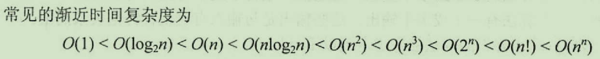
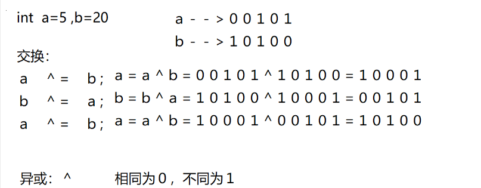
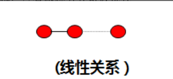

# 数据结构与算法

数据结构 + 算法 = 程序

## 数据结构

概念： 数据的逻辑结构存储结构及操作。

### 数据

数据：不只是一个单独的数值，是一个集合的概念。
数据元素：数据的最小单位，由基本的数据项构成。
（如：一本书的信息--》书名、价格、书编号等）
数据项：是数据元素的基本单位，描述数据元素拥有的信息。
节点：就是数据元素

### 逻辑结构

概念：描述数据之间的逻辑规律和联系 (元素与元素之间的关系)
逻辑结构的分类：
1.线性结构 --->线性存储-->一对一的关系 --->顺序表、链表
头节点无前驱、尾节点无后继
2.层次结构 -->树 --->一对多的关系 -->树
根节点无前驱，叶子节点无后继
3.网状结构 --->图 --->多对多的关系 --->图
举例：1：A B 2：C D 3:E F

### 存储结构

概念：数据的逻辑结构在计算机中的具体实现
存储结构分类：

1. 顺序存储：内存空间开辟是连续

数组：内存空间连续开辟，数据元素类型相同
2. 链式存储：通过地址将数据元素联系在一起

3. 索引存储：通过索引表找到数据元素存放位置，拿到数据
存在两个表格--》索引表 和 数据表
书名---》数据表中查寻书的位置
4. 散列存储结构 (哈希存储)
数据元素的存放和位置之间存在一个关系。
存在一个关键字key和一个关系函数，通过关键值key带入关系函数计算出数据存放的位置。对应位置存放、对应位置取值。

### 操作

增  删  改  查

## 算法

### 算法与程序

算法：解决问题的思想办法 
程序：用计算机语言对算法的具体实现

### 算法与数据结构

算法+数据结构=程序
算法的设计：依赖于逻辑结构
算法的实现：依赖于存储结构

### 算法的特性

**有穷性**：算法的执行步骤是有限的
**确定性**：算法的每一个步骤，无二义性 ，没有歧义
**可行性**：算法能够在有限的时间内完成 
**输入和输出**：一个算法可以有一个或多个输入和输出

### 如何评价一个算法的好坏

**正确性**：保证算法能够正确的完成功能的实现
**易读性**：算法容易被解读
**健壮性**：错误处理
**高效性**：算法执行效率，算法执行快慢容易受到计算机性能的影响，所以不可以作为评判高效性的标准，这里用可执行语句重复执行的次数来衡量高效性//时间复杂度
**低存储性**:算法占用空间小//空间复杂度

### 时间复杂度
（程序运行的速度）
算法的可执行语句重复执行的 频度和 	
语句频度： 算法中可执行语句重复执行的次数 	
通常时间复杂度用一个问题规模函数来表达 	
T(n) = O(f(n))
T(n) 问题规模的时间函数 
n  代表的是问题的规模 指的输入数据量的大小
O 时间数量级 	
f(n) 算法中可执语句重复执行的次数 用问题规模n的某个函数f(n)来表达 (f是函数)



```c
例子1：
	
		求 1 + 2 + 3 + 4 + ....... n 的和 
		
		//算法一 	
		
		int sum = 0;	             
		int i;
		for(i = 1; i <= n; i++)      
		{
			sum += i;
		}									
	
											
		
		//算法二
		
		int sum = n*(n+1)/2       									
								   	
								   								
								  	
	
	例2：	
	int i,j;
	for(i = 0; i < n; i++)//外循环循环一次，内循环跑一圈   
	{
		for(j = 0; j < n; j++)
		{
			printf("hello world!!\n"); 
		}
	}
	
		
	
	例3 	
	int i,j;
	for(i = 0; i < n; i++)//外循环循环一次，内循环跑一圈   
	{
		for(j = 0; j <= i; j++)//内循环的次数与i的值相关 
		{
			printf("hello world!!\n"); 
		}
	}
	
	i的值      循环次数
	i == 0        1
	i == 1        2
	i == 2        3
	
	...
	...
	i == n-2      n-1
	i == n-1      n 
	
	循环次数 = 1 + 2 + 3 + 4 + ..... + n

	f(n) = n*(n+1)/2
	
	f(n) = n^2/2 + n/2  //最高项n^2  ，只保留最高项，其它项舍去  f(n) = n^2/2 ，在除以最高项系数 除以1/2  f(n) = n^2
	
	//经过处理之后 
	
	T(n) = O(n^2)
	
	计算大O的方法 
	
	(1)根据问题规模n写出表达式 f(n)
	
	(2)如果有常数项，将其置为1 //当f(n)的表达式中只有常数项的时候，有意义 f(n) = 8
	
	(3)只保留最高项，其它项舍去
	
	(4)如果最高项系数不为1，除以最高项系数 
	
	
	f(n) = 3*n^5 + 2*n^3 + 6*n + 10
	
	//10 代表的是常数项
	
	//3*  2* 6* 系数项 
	
	//最高项指的是指数 ^5 ^3 ^1  最高项为 n^5
	
	T(n) = O(n^5)
	
	f(n) = 8;//最高项 n^0
	
	T(n) = O(1);
```
### 空间复杂度

算法占用的空间大小。一般将算法的辅助空间作为衡量空间复杂度的标准。
算法占用的存储空间包括：
1. 输入输出数据所占空间
2. 算法本身所占空间
3. 额外需要的辅助空间

```c
void swap(int *a,int *b)
{
	int temp;
	temp = *a;
	*a = *b;
	*b = temp;
}
```
输入输出数据所占空间是必须，算法本身所占空间可以通过精简算法来缩减，而在运行时候使用的辅助变量所占空间，即辅助空间是衡量 空间复杂度的关键因素。

### 位运算交换



## 线性表

线性表：顺序表  链表(单向链表 单向循环链表  双向链表 双向循环链表)  栈  队列
逻辑结构：线性结构
存储结构：顺序存储结构  链式存储结构
特点：一对一的关系，头节点没有前驱，尾节点没有后继



### 顺序表

**特点：内存空间是连续开辟(数组)。
逻辑结构：线性结构
存储结构：顺序存储结构**

**定义一个结构体表示顺序表：**
```c
 #define  N 10
 typedef  int   datatype_t;
  typedef struct  list_t
 {
    datatype_t  data[N];//表
    int last //保存最后一个有效元素的下标 (-1 表为空)
 }seqlist_t,*seqlist_p；
seqlist_t   stu   ==  struct  list_t stu
seqlist_p  sp   ==  struct  list_t *sp
```
顺序表操作：增删改查(函数结构)
1. 创建一个空的顺序表  
2. 向顺序表的指定位置插入数据
3. 判断顺序表是否满
4. 指定位置删除数据
5. 判断顺序表是否为空
6. 修改指定位置的数据
7. 删除指定的数据
8. 清空顺序表
9. 删除顺序表
10. 遍历顺序表

**分文件实现 seqlist.c seqlist.h main.c Makefile**

```c
 //seqlist.c
#include <stdio.h>
#include <stdlib.h>
#include "seqlist.h"

//1.创建一个空的顺序表
//要通过一个函数更改一个变量的值，有两种方式 1》函数的返回值
//2》通过将变量的地址传递给函数，函数更改变量的值
seqlist_t *createSeqList(void)
{
    seqlist_t *p = (seqlist_t *)malloc(sizeof(seqlist_t));
    if (NULL == p)
    {
        printf("malloc seqlist err.\n");
        return NULL;
    }
    p->last = -1; //空表
    return p;
}
//2.向顺序表的指定位置插入数据
int insertPost(seqlist_t *p, int post, datatype_t data)
{
    //1.容错处理
    if (post > p->last + 1 || post < 0 || p->last + 1 == N)
    {
        printf("post insert err.\n");
        return -1;
    }
    //2.将指定位置及之后的数据全部后移一个
    for (int i = p->last + 1; i > post; i--)
    {
        p->data[i] = p->data[i - 1];
    }
    //3.插入
    p->data[post] = data;
    p->last++;
    return 0;
}

//3.判断表是否为满  0没满   1满
int isFullSeqList(seqlist_t *p)
{
    return p->last + 1 == N;
}

//4.遍历顺序表，输出表中的数据
void showSeqList(seqlist_t *p)
{
    for (int i = 0; i <= p->last; i++)
    {
        printf("%d ", p->data[i]);
    }
    putchar(10);
}

//5.判断顺序表是否为空  1空  0非空
int isEmptySeqList(seqlist_t *p)
{
    return p->last == -1;
}

// 6.修改指定位置的数据
int changeSeqList(seqlist_t *p,int post,datatype_t data)
{
    //1.判断位置是否正确
    if(post < 0 || post > p->last || isEmptySeqList(p))
    {
        printf("change post err.\n");
        return -1;
    }
    p->data[post]=data;
    return 0;
}
//8.删除指定位置的数据
int delectPost(seqlist_t *p,int post)
{
    //1.判断位置是否正确
    if(post < 0 || post > p->last || isEmptySeqList(p))
    {
        printf("delect post err.\n");
        return -1;
    }
    for(int i=post;i<p->last;i++)
    {
        p->data[i]=p->data[i+1]
    }
    p->last--;
    return 0;
}

//7.删除指定的数据
int delectDate(seqlist_p *p,datatype_t *data)
{
    if(isEmptySeqList(p))
    {
        printf("is empty.\n");
        return -1;
    }
    for(int i=0;i<=p->last;i++)
    {
        if(p->data[i]==data)
        {
            delectPost(p,i);
            i--;
        }
    }
}

//9.清空顺序表
void clearSeqList(seqlist_t *p)
{
    p->last=-1;
}
// 10.删除顺序表
void delectList(seqlist_t **sp)
{
    free(*sp);
    *sp=NULL;
}
```

```c
//seqlist.h
#include <stdio.h>
#include <stdlib.h>
#include "seqlist.h"
//定义一个顺序表的结构体
#define N 5
typedef int datatype_t;
typedef struct list_t
{
    datatype_t data[N];
    int last;
} seqlist_t, *seqlist_p;

//1.创建一个空的顺序表
//要通过一个函数更改一个变量的值，有两种方式 1》函数的返回值
//2》通过将变量的地址传递给函数，函数更改变量的值
seqlist_t *createSeqList(void);
//2.向顺序表的指定位置插入数据
int insertPost(seqlist_t *p, int post, datatype_t data);
//3.判断表是否为满  0没满   1满
int isFullSeqList(seqlist_t *p);
//4.遍历顺序表，输出表中的数据
void showSeqList(seqlist_t *p);
//5.判断顺序表是否为空  1空  0非空
int isEmptySeqList(seqlist_t *p);
//6.修改指定位置的数据
int changeSeqList(seqlist_t *p,int post,datatype_t data);
//7.删除指定的数据
int delectDate(seqlist_p *p,datatype_t *data);
//8.删除指定位置的数据
int delectPost(seqlist_t *p,int post);
//9.清空顺序表
void clearSeqList(seqlist_t *p);
// 10.删除顺序表
void delectList(seqlist_t **sp);
```

```c
//main.c
#include <stdio.h>
#include <stdlib.h>
#include "seqlist.h"

int main(int argc, char const *argv[])
{
    seqlist_t *p = createSeqList();
    int a = 1, post = 0; //1-5
	//循环添加数据
    while (1)
    {
        if (isFullSeqList(p))
        {
            break;
        }
        else
        {
            insertPost(p, post, a);
            post++;
            a++;
        }
    }
    showSeqList(p);
	changSeqlist(p,2,100);
	showSeqlist(p);
	delectDate(p,100);
	showSeqlist(p);
	delectPost(p,3);
	showSeqlist(p);
	clearSeqlist(p);
	showSeqlist(p);
	delectlist(&p);
    free(p);
    p=NULL;

    return 0;
}
```

```sh
//Makefile
EXEC=main
OBJS=main.o
OBJS+=seqlist.o
CC=gcc
CL=clean
$(EXEC):$(OBJS)
	$(CC) -o $@ $^
.o:.c
	$(CC) -c $<
$(CL)
	rm *.o
	rm main
rebuild:$(CL) $(EXEC)
```

#### 定义函数名的标准

下划线法：create_seq_list
小驼峰法：createSeqList
大驼峰法：CreateSeqList

#### 顺序表的特点

1. 内存空间连续开辟
2. 长度固定(保存的数据元素个数是固定的)       #define N  10
3. 插入和删除比较复，查询操作或修改比较简单。

### 链表

链表：内存空间开辟不是连续、通过地址将多有的内存空间联系到一起

逻辑结构：线性结构
存储结构：链式存储

单向链表：
1. 有头单向链表
链表中的头节点数据域无效，指针域有效。
2. 无头单向链表
链表中所有节点的数据域和指针域都是有效的。

**定义链表节点结构体**

```c
typedef  int  datatype_t;
typedef struct  node_t //node 节点
{
    datatype_t data;//数据域
    struct node_t *next;//指针域  保存下一个节点的地址
}linklist_t,*linklist_p;  //link  链
```

**链表的操作：有头单向链表**